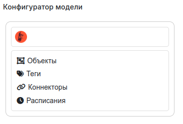

<div style="text-align: center;">
   
</div>

[](https://opensource.org/licenses/Apache-2.0)

[](https://coveralls.io/github/mp-co-ru/peresvet?branch=dev)

# МПК-Пересвет

Платформа для моделей технических объектов: иерархия, теги, тревоги,
методы, коннекторы, расписания и хранилища данных.
Интерфейс — Grafana, точка входа в сервисы — nginx.

Полная документация собирается из `docs/` и публикуется на
[mp-co-ru.github.io/peresvet](https://mp-co-ru.github.io/peresvet/).

# Запуск

Нужны Linux и [Docker](https://docs.docker.com/engine/install/) с плагином
`docker compose`. После установки Docker выполните
[настройку прав](https://docs.docker.com/engine/install/linux-postinstall/),
чтобы команды ниже шли без `sudo`.

Скрипт `./run_one_app.sh` скачивает недостающие образы, собирает локальные
и запускает контейнеры в фоне: RabbitMQ, Redis, OpenLDAP, PostgreSQL,
ядро платформы, видеосервер, Grafana и nginx.
Первый запуск занимает несколько минут.

## Из архива релиза

Архив `peresvet-product-<tag>.tar.gz` лежит в
[релизах](https://github.com/Vovaman/peresvet/releases).

```bash
tar -xzf peresvet-product-<tag>.tar.gz
cd peresvet-product-<tag>
./run_one_app.sh
```

## Из репозитория

```bash
git clone git@github.com:mp-co-ru/peresvet.git
cd peresvet
./run_one_app.sh
```

Параметры по умолчанию читаются из `.env` рядом со скриптом.
Менять его перед первым запуском не нужно.
Ключи командной строки перекрывают `.env`:

```bash
./run_one_app.sh --hostname <имя-сервера>
./run_one_app.sh --build true
./run_one_app.sh --help
```

Зеркало образов, HTTPS и сборка дистрибутива описаны в разделе
[«Установка и запуск»](https://mp-co-ru.github.io/peresvet/installation.html).

## Открыть платформу

Когда контейнер `prs-nginx-one-app` запущен, откройте в браузере:

```text
http://localhost/grafana
```

Если платформа на другой машине, подставьте её адрес.
Имя и пароль при первом входе: `admin` / `admin`.
Grafana предложит сменить пароль. Дальше откроется конфигуратор модели.

<div style="text-align: center;">
   
</div>

Дальше по интерфейсу:
[конфигуратор](https://mp-co-ru.github.io/peresvet/configurator/configurator.html),
[подключение видеокамер](https://mp-co-ru.github.io/peresvet/video.html),
[пример с объектом и тегом](https://mp-co-ru.github.io/peresvet/examples/examples.html).

## Остановка

Из каталога, где лежит `./run_one_app.sh`:

```bash
docker compose --env-file docker/compose/.cont_one_app.env \
  -f docker/compose/docker-compose.redis.yml \
  -f docker/compose/docker-compose.rabbitmq.yml \
  -f docker/compose/docker-compose.ldap.one_app.yml \
  -f docker/compose/docker-compose.postgresql.data_in_volume.yml \
  -f docker/compose/docker-compose.one_app.yml \
  -f docker/compose/docker-compose.video.yml \
  -f docker/compose/docker-compose.grafana.yml \
  -f docker/compose/docker-compose.nginx.one_app.yml \
  -f docker/compose/docker-compose.ports.yml \
  -f docker/compose/docker-compose.restart.yml \
  down
```

Для HTTPS замените файл nginx на `docker-compose.nginx.one_app.ssl.yml`.
Тома с данными остаются.

# Документация и проверка

Раздел администрирования (резервные копии Docker и LDAP) —
[administration.html](https://mp-co-ru.github.io/peresvet/administration.html),
исходник `docs/source/administration.rst`.

Локальная сборка HTML, из каталога `docs` после установки зависимостей проекта:

```bash
make html
```

Результат: `docs/build/html/index.html`.

Unit-тесты из корня репозитория:

```bash
.venv/bin/python -m pytest tests/unit
```
