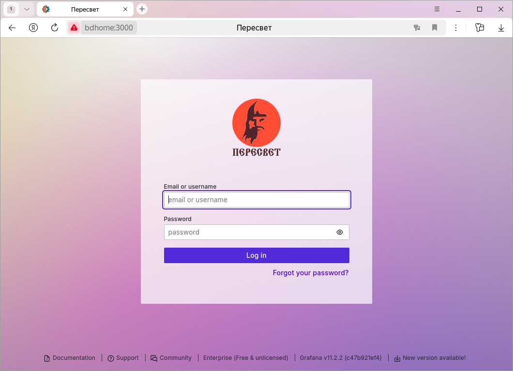
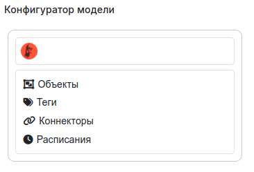

<div align="center">
  

  **An open platform for industrial automation, IoT, and smart object modeling**

  [](LICENSE)
  [](https://vovaman.github.io/peresvet/)
  [](https://github.com/Vovaman/peresvet/releases)

  [Documentation](https://vovaman.github.io/peresvet/) · [Examples](https://github.com/Vovaman/peresvet_examples) · [Русский](README.md)
</div>

---

## What is Peresvet?

**MPC-Peresvet** is an open-source platform for building automation systems for technical objects: industrial plants, smart buildings, production lines. Inspired by PI System (OSIsoft) and GE iHistorian — the same core functionality, built on modern technology, free to use.

Peresvet provides what ordinary time-series databases (Prometheus, VictoriaMetrics) lack: an **object hierarchy**, **calculated tags**, **alarms**, **external methods**, **bidirectional connectors** — everything you need to build a full-featured SCADA or MES system.

---

## Use cases

| Domain | Examples |
|---|---|
| **Industrial automation** | SCADA, dispatch, monitoring, MES |
| **Efficiency monitoring** | OEE analysis for production lines ([example: Abrau-Durso winery](https://github.com/ioterra-ru/customer-abraudurso)) |
| **Smart home / building** | Zigbee2MQTT integration, device control |
| **Embedded systems** | Raspberry Pi, ARM64 hardware-software complexes |

---

## Key features

- **Object hierarchy** — model your enterprise as a tree of objects with tags, alarms, and schedules
- **Calculated tags** — parameters computed from other tags in real time
- **External methods** — Python scripts triggered by events (tag change, alarm, schedule)
- **Connectors** — bidirectional data exchange via MQTT, WebSocket, and other protocols
- **Historical data** — PostgreSQL and/or VictoriaMetrics storage
- **Grafana UI** — visualization, mnemonics, built-in model configurator
- **Animated SVG mnemonics** — via [prs-inkscape-grafana](https://github.com/ioterra-ru/prs-inkscape-grafana)
- **MCP integration** — manage the platform from AI tools (Claude, Cursor, etc.)
- **Docker deployment** — from a single container to a full microservice architecture

---

## Editions

| Feature | Open Edition (this repo) | [Industrial Edition](https://github.com/mp-co-ru/mpc-peresvet) |
|---|:---:|:---:|
| License | Apache 2.0 (free) | Commercial |
| Object model (hierarchy, tags, alarms, methods) | ✅ | ✅ |
| MQTT / WebSocket connectors | ✅ | ✅ |
| Grafana UI + configurator | ✅ | ✅ |
| MCP server (AI integration) | ✅ | ✅ |
| PostgreSQL / VictoriaMetrics storage | ✅ (one at a time) | ✅ (multiple simultaneously) |
| High availability (HA) and clustering | — | ✅ |
| Industrial protocols (OPC UA, Modbus, etc.) | — | ✅ |
| Pre-built industry models | — | ✅ |
| Separation of model and runtime | — | ✅ |
| Official support (SLA) | — | ✅ |

> Need the industrial edition or commercial support? Contact us: [mp-co-ru](https://github.com/mp-co-ru).

---

## Quick start

### Requirements

- Ubuntu 22.04+ (or any Linux with Docker)
- [Docker](https://docs.docker.com/engine/install/ubuntu/) + Docker Compose

### Installation

```bash
# Download the latest release
wget https://github.com/Vovaman/peresvet/releases/latest/download/peresvet.tar.gz
tar -xzf peresvet.tar.gz
cd peresvet

# Start the platform (all services in one container — recommended for getting started)
./run_one_app.sh
```

Open your browser: **http://localhost/grafana**

> Default credentials: `admin` / `admin`. Grafana will prompt you to change the password on first login.

<div align="center">
  
</div>

The model configurator dashboard opens by default:

<div align="center">
  
</div>

### Deployment modes

| Script | Purpose |
|---|---|
| `./run_one_app.sh` | All services in one container (recommended for getting started and small systems) |
| `./run_all_svc_in_one.sh` | All platform services in one container (no external dependencies) |
| `./run.sh` | Each entity group in a separate container (microservice architecture) |
| `sudo ./run_one_app_ssl_letsencrypt_generate_certificates.sh <domain>` | Obtain a Let's Encrypt TLS certificate for a public server |
| `./run_one_app_ssl_letsencrypt.sh` | Start with HTTPS (after obtaining the certificate) |

Full installation guide: [documentation](https://mp-co-ru.github.io/mpc-peresvet/installation.html).

---

## Architecture

```
Browser (Grafana / Configurator)
        │
      nginx  ──── MCP servers (AI clients: Claude, Cursor...)
        │
    one_app (FastAPI)
    ├── Objects   ── OpenLDAP (object model hierarchy)
    ├── Tags      ── Redis (cache) + PostgreSQL / VictoriaMetrics (history)
    ├── Alarms    ─┐
    ├── Methods   ─┤── RabbitMQ (events and commands)
    ├── Connectors─┘
    └── Schedules
```

Services communicate via RabbitMQ. The object model is stored in OpenLDAP. The platform supports both monolithic (`one_app`) and distributed (microservice) deployment modes.

---

## MCP servers (AI integration)

The platform supports MCP (Model Context Protocol), enabling direct management from AI tools (Claude Desktop, Cursor, etc.).

| Endpoint | URL |
|---|---|
| MCP Peresvet (HTTP) | `http://<server>/mcp/peresvet/mcp` |
| MCP Peresvet (SSE) | `http://<server>/mcp/peresvet/sse` |
| MCP Grafana (HTTP) | `http://<server>/mcp/grafana/mcp` |

Transport configuration in `docker/compose/.cont_one_app.env`:
- `MCP_PERESVET_TRANSPORT` — `sse` | `http` | `stdio`
- `MCP_GRAFANA_TRANSPORT` — `sse` | `streamable-http`

---

## Examples and ecosystem

- [peresvet_examples](https://github.com/Vovaman/peresvet_examples) — step-by-step examples for working with the platform
- [customer-abraudurso](https://github.com/ioterra-ru/customer-abraudurso) — OEE monitoring for a production line (deployed at Abrau-Durso winery)
- [prs-inkscape-grafana](https://github.com/ioterra-ru/prs-inkscape-grafana) — create animated SVG mnemonics using Inkscape

---

## Documentation

Full documentation (in Russian): **https://vovaman.github.io/peresvet/**

- [Description and glossary](https://vovaman.github.io/peresvet/description.html)
- [Installation](https://mp-co-ru.github.io/mpc-peresvet/installation.html)
- [Configurator guide](https://vovaman.github.io/peresvet/configurator/configurator.html)
- [Examples](https://vovaman.github.io/peresvet/examples/examples.html)
- [API reference](https://vovaman.github.io/peresvet/api.html)
- [Architecture](https://vovaman.github.io/peresvet/architecture.html)

---

## Administration

### Docker runtime backup

```bash
cd /path/to/peresvet
./admin_scripts/docker/running_containers_backup.sh
```

Restore:

```bash
./admin_scripts/docker/running_containers_restore.sh \
  --archive=backups/docker_runtime/ARCHIVE_NAME.tar.gz
```

### OpenLDAP backup (object model)

```bash
./admin_scripts/ldap/ldap_volume_backup.sh
```

Restore:

```bash
./admin_scripts/ldap/ldap_volume_restore.sh \
  --assume_yes=1 \
  --archive=backups/ldap/ARCHIVE_NAME.tar.gz
```

See [administration documentation](https://vovaman.github.io/peresvet/administration.html) for full parameter reference.

---

## Development and debugging

The platform is developed with VSCode. For local development:

```bash
# Set up virtual environment
pipenv install

# Start infrastructure without platform services
./run_one_app_debug.sh

# Open src/services/one_app/one_app.py and run in debug mode
```

For debugging inside a container:

```bash
# Start containers
./run.sh -d

# Start debugging a specific service (example: app_psql in container f438)
./run_debug.sh f438 app_psql
```

In VSCode select the `MPC_DEBUG: f438 app_psql` configuration and press F5.

The `ms-vscode-remote.remote-containers` plugin is required.

---

## Tests

```bash
# Unit tests with coverage report
./run_tests.sh
```

Load tests (Locust) are described in the [documentation](https://vovaman.github.io/peresvet/).

---

## Building docs

```bash
cd docs
make html
# Output: docs/build/html/index.html
```

---

## Contributing

We welcome community contributions! See [CONTRIBUTING.md](CONTRIBUTING.md) for details.

---

## License

Apache 2.0 — see the [LICENSE](LICENSE) file.
