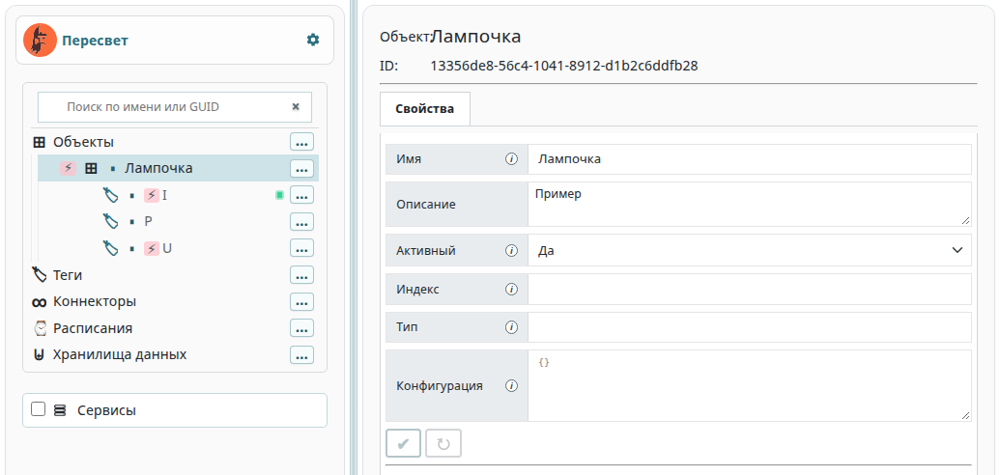
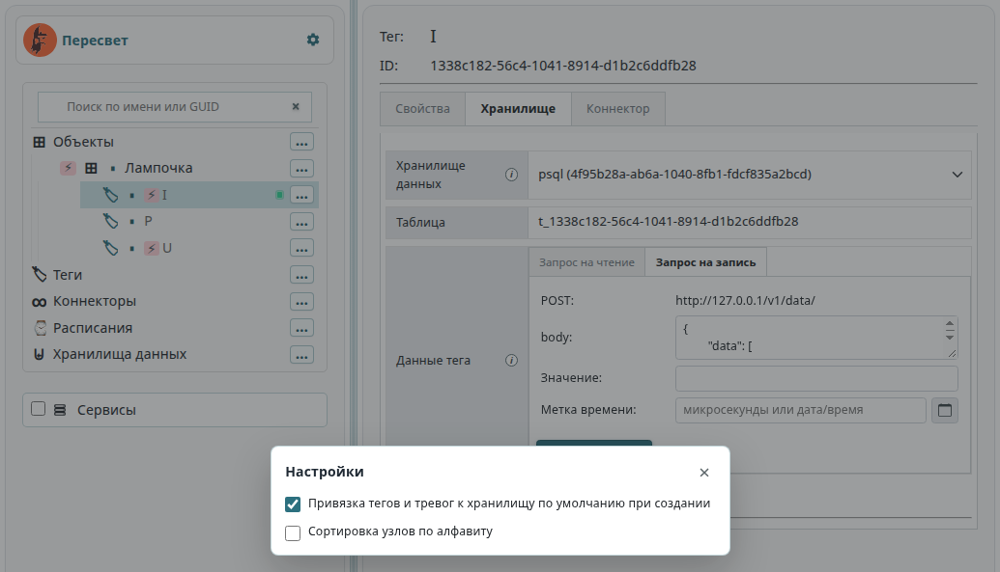
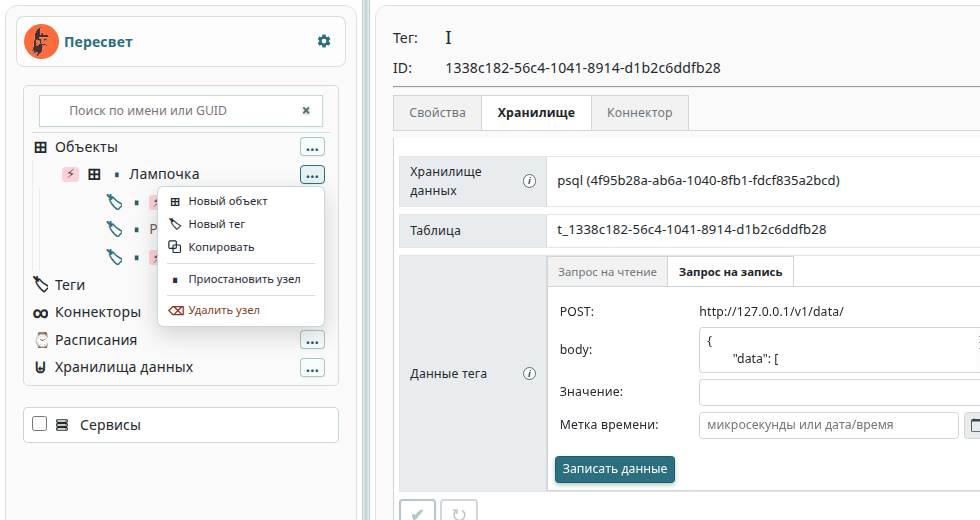
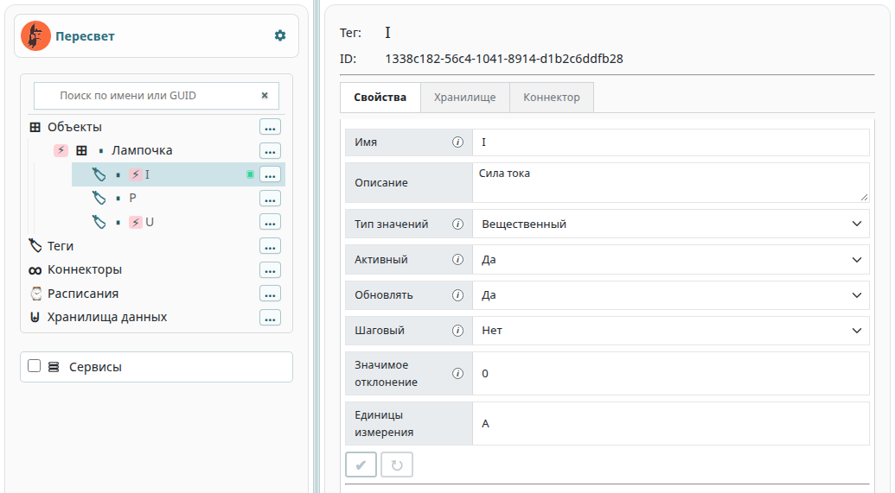
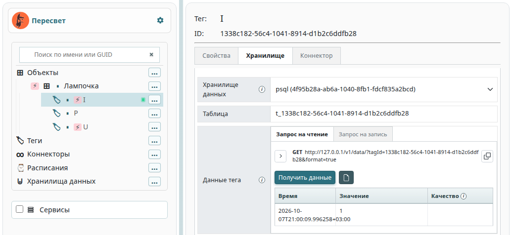
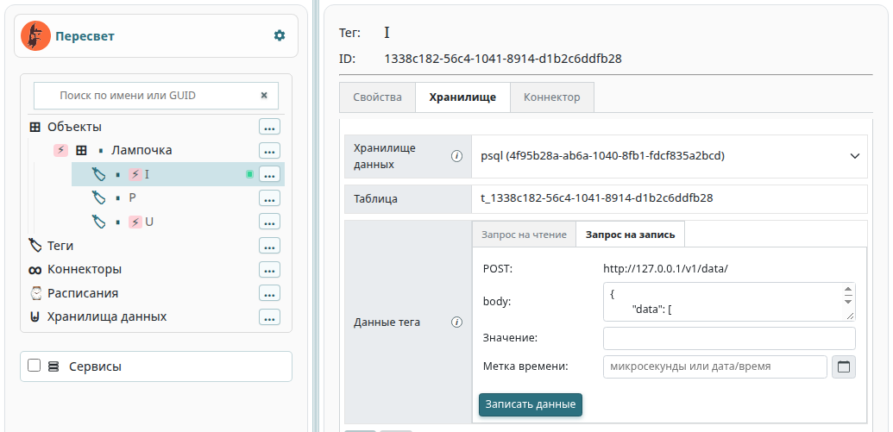

.. _configurator:

Конфигуратор модели
-------------------

Конфигуратор — главная панель Grafana. В нём собирают иерархию
платформы: объекты, теги, тревоги, методы, коннекторы, расписания
и хранилища данных. Туда же выведены журналы сервисов.

Конфигуратор ходит в платформу через :ref:`API <api>`.
Форматы команд создания, чтения, обновления и удаления узлов
описаны в документации API.

Как открыть
^^^^^^^^^^^

Запустите платформу (:ref:`installation`) и откройте в браузере
``http://localhost/grafana``. Если платформа стоит на другом компьютере,
подставьте его адрес.

При первом входе имя и пароль — ``admin`` / ``admin``.
Grafana предложит сменить пароль.

   Слева дерево модели, справа свойства выбранного узла.
   Между колонками — разделитель: его можно перетащить.
   Такой же разделитель стоит между иерархией и блоком «Сервисы».

Пока узел не выбран, справа написано «Выберите узел в дереве слева».

Папки модели
^^^^^^^^^^^^

На верхнем уровне лежат папки сущностей.

**Объекты.** Основная иерархия. Внутри объекта бывают другие объекты и теги.
У тега — тревоги и методы.

**Теги.** Теги без привязки к объекту: линейный список параметров.

**Коннекторы.** Описания :ref:`коннекторов <definition_connector>`.
Состав полей зависит от коннектора. Камера — частный случай коннектора,
см. :ref:`video_cameras`.

**Расписания.** Генераторы событий по времени.

**Хранилища данных.** Куда пишутся история тегов и события тревог.
У одного хранилища может стоять признак «по умолчанию».

**Сервисы.** Журналы процессов платформы. Это не узлы модели.

Порядок внутри одного типа задаёт атрибут ``prsIndex``.
Алфавитная сортировка включается в настройках и запоминается в браузере.

Поиск
^^^^^

Над деревом поле «Поиск по имени или GUID».
Список показывает совпадения по имени и по идентификатору.
Выбор строки раскрывает ветку и делает узел текущим.

Настройки
^^^^^^^^^

Шестерёнка стоит в одной строке с надписью «Пересвет», у правого края.
Окно запоминает флажки в браузере.

**Привязка тегов и тревог к хранилищу по умолчанию при создании.**
Если флажок включён, новый тег или новая тревога сразу привязываются
к хранилищу с признаком «по умолчанию». Если флажок снят, узел создаётся
без этой привязки. Тег типа «Видеопоток» к хранилищу истории не привязывается
в любом случае.

**Сортировка узлов по алфавиту.**
Сначала узлы группируются по типу: объекты, затем теги, тревоги, методы,
коннекторы, расписания и хранилища. Пока флажок снят, внутри типа
сохраняется порядок платформы по ``prsIndex``. Если флажок включён,
внутри типа узлы сортируются по имени. Настройка применяется и к уже
раскрытым веткам.

Меню команд узла
^^^^^^^^^^^^^^^^

У строки дерева слева стоит кнопка «…» с подсказкой «Команды».
В меню только те пункты, которые допустимы для этого узла.
``Escape`` и щелчок мимо меню его закрывают.

+---------------------------+----------------------------------------------+
| Узел                      | Пункты меню                                  |
+===========================+==============================================+
| Папка «Объекты»           | Новый объект                                 |
+---------------------------+----------------------------------------------+
| Объект                    | Новый объект, новый тег, копировать,         |
|                           | приостановить, удалить                       |
+---------------------------+----------------------------------------------+
| Папка «Теги»              | Новый тег                                    |
+---------------------------+----------------------------------------------+
| Тег                       | Новая тревога, новый метод, копировать,      |
|                           | приостановить, удалить                       |
+---------------------------+----------------------------------------------+
| Тревога                   | Новый метод, копировать, приостановить,      |
|                           | удалить                                      |
+---------------------------+----------------------------------------------+
| Метод                     | Копировать, приостановить, удалить           |
+---------------------------+----------------------------------------------+
| Папка «Коннекторы»        | Новый коннектор                              |
+---------------------------+----------------------------------------------+
| Коннектор                 | Приостановить, удалить                       |
+---------------------------+----------------------------------------------+
| Папка «Расписания»        | Новое расписание                             |
+---------------------------+----------------------------------------------+
| Расписание                | Приостановить, удалить                       |
+---------------------------+----------------------------------------------+
| Папка «Хранилища данных»  | Новое хранилище                              |
+---------------------------+----------------------------------------------+
| Хранилище                 | Приостановить, удалить                       |
+---------------------------+----------------------------------------------+

Новый узел создаётся с параметрами по умолчанию: имя совпадает
с идентификатором, справа сразу открываются его свойства.

**Копировать.** Копия появляется рядом с исходным узлом, вместе с потомками.
Если такое имя уже занято, платформа подбирает свободное.
Для объекта конфигуратор сначала спрашивает имя копии.

**Приостановить** и **Включить** меняют признак «Активный»
у выбранного узла и у потомков, которые уже раскрыты в дереве.
Свёрнутая ветка, которую дерево ещё не загрузило, в этот обход не попадает.
У приостановленного узла имя бледнее, а значок у строки подписан
«Узел приостановлен».

**Удалить** убирает узел и всех его потомков.

Копирование, удаление и приостановка спрашивают подтверждение:
окно с жёлтым треугольником, кнопки «Подтвердить» и «Отмена».

Перетаскивание
^^^^^^^^^^^^^^

Объекты и теги можно переносить мышью. Папки верхнего уровня
не перетаскиваются.

Узел отпускают на объект: он становится его потомком.
Перенос внутрь самого себя или внутрь своего поддерева конфигуратор отклоняет.

Несколько узлов одного вида выделяют вместе.
``Ctrl`` (на macOS ``Cmd``) добавляет строку к выделению,
``Shift`` выделяет диапазон среди соседей того же вида.
Перетаскивание любой выделенной строки переносит всю группу.
Обычный щелчок выделение снимает.

Пометки в дереве
^^^^^^^^^^^^^^^^

Подсказка строки собирается из того, что конфигуратор уже знает об узле.

* Знак паузы на родителе — в ветке есть приостановленный узел.
* Знак «пусто» (∅) у тега или тревоги — нет привязки к хранилищу данных.
  Тот же знак на родителе значит, что такая привязка отсутствует где-то в ветке.
* Молния у тега — нет ни коннектора, ни дочернего метода, откуда брались бы данные.
* У хранилища с признаком «по умолчанию» стоит соответствующая пометка.
* Кружок у коннектора — сессия MQTT. Зелёный: связь есть.
  Красный: сессии нет. Серый: статус ещё не получен.
  Конфигуратор спрашивает статус примерно раз в пять секунд.
  У камеры кружок зелёный, пока видеосервер держит сеанс RTSP.

Свойства узла
^^^^^^^^^^^^^

Справа — имя, идентификатор и поля, которые относятся к этому виду узла.
Изменённое поле обводится бирюзовой рамкой.

Пока есть несохранённые правки, активны две кнопки под формой:

* галочка **Записать** — отправить правки в платформу;
* круговая стрелка **Сбросить** — вернуть значения, которые были при открытии узла.

Имя, описание и признак «Активный» есть почти у всех узлов.
Остальной набор зависит от вида.

**Объект.** Индекс, код типа, конфигурация JSON.

**Тег.** Тип значений, «Обновлять», «Шаговый», значимое отклонение,
единицы измерения и блок «Данные тега».
Типы значений: целый, вещественный, строковый, json, интеграционный,
видеопоток.

**Тревога.** Сравнение значения тега (``>=`` или ``<``), порог
и тип квитирования: вручную или автоматически.

**Метод.** Адрес, под которым метод зарегистрирован в системе,
код типа и блоки инициаторов и параметров.
Код ``0`` — вычислительный метод по инициаторам.
Код ``1`` — виртуальный: ответ ``GET /v1/data`` берётся из метода,
без чтения базы.

**Коннектор.** Конфигурация JSON, флажок «Лог в платформу»,
журнал и команды.

**Расписание.** Начало, конец и шаг: секунды, минуты, часы или дни.

**Хранилище данных.** Признак «по умолчанию», код типа и конфигурация JSON.

Поле «Активный» у одного узла при записи меняет только этот узел.
Чтобы выключить раскрытую ветку целиком, пользуйтесь пунктом меню
«Приостановить».

Тег: хранилище и коннектор
^^^^^^^^^^^^^^^^^^^^^^^^^^

У тега и у тревоги справа появляется вкладка **Хранилище**.
У тега есть ещё вкладка **Коннектор**.

**Хранилище.** Одно хранилище на тег. Смена отвязывает тег от предыдущего.
На этой же вкладке лежит блок «Данные тега»: запрос на чтение, запись и экспорт.
Тревога привязывается к хранилищу на этой вкладке и не имеет своего блока данных.
Папка «Хранилища данных» в дереве показывает те же связи со стороны хранилища.

**Коннектор.** Одно подключение на тег. В поле конфигурации привязки
лежит JSON ``prsJsonConfigString`` узла связи тега с коннектором:
адреса регистра, топики и прочие параметры источника.
Кнопка записи сохраняет и свойства тега, и эту привязку.

Тег «Видеопоток» к хранилищу истории не привязывают.
Вкладка **Хранилище** у него всё равно открывает просмотр.
Связь — с коннектором-камерой. Подробности в :ref:`video_cameras`.

Данные тега
^^^^^^^^^^^

Блок «Данные тега» стоит на вкладке **Хранилище**.
Он есть у обычного тега с выбранным хранилищем и у тега «Видеопоток»
даже без привязки к истории.

Запрос на чтение
________________

Вкладка показывает готовый ``GET`` и адрес. Кнопка рядом копирует запрос.

Ключи запроса совпадают с :ref:`получением исторических данных <historical_data>`:
``format``, ``actual``, ``start``, ``finish``, ``count``, ``value``,
``timeStep``, ``maxCount``. У ``start`` и ``finish`` есть календарь
и кнопка очистки. В строку можно вставить дату из таблицы ответа.

**Получить данные** выполняет запрос и заполняет таблицу «Время / Значение / Качество».
Коды качества те же, что в :ref:`qualityCodes`.

Для интеграционного тега на этой вкладке дополнительно задаётся ``params`` —
JSON фактических значений операции.

Запрос на запись
________________

Вкладка **Запрос на запись** задаёт значение и, при необходимости, метку времени.
Перед отправкой значение приводится к типу тега: целое, вещественное,
строка или JSON. Пустая метка означает текущий момент.
Заполненная метка — целое число микросекунд или строка даты и времени.
Кнопка календаря подставляет дату строкой с часовым поясом.

Кнопка **Записать данные** отправляет ``POST /v1/data/``.
У видеопотока этой вкладки нет: кадр в историю тегов не пишется.

Экспорт в CSV
_____________

После успешного **Получить данные** становится доступна кнопка
**Сохранить в CSV**. Успешным считается HTTP-ответ с кодом ``2xx``
и корректным JSON. Пустой список тоже можно экспортировать.
Ошибка HTTP или JSON, новый запрос и смена тега или любого параметра
очищают таблицу и блокируют экспорт до следующего успешного чтения.

Имя файла: ``<имя тега> :: <текущая метка времени>.csv``.
Метка берётся в момент сохранения, в локальном часовом поясе.
Внутри файла сначала идут имя тега, его id и полная строка запроса
(``GET`` и URL), затем ключи запроса и их значения.
После заголовка ``x,y,q`` записываются точки.
Если в запросе был ключ ``format``, метки ``x`` попадают в файл
строками ISO 8601. Если ключ снят, ``x`` записывается целым числом
микросекунд, как в ответе платформы.

В файл попадают полный URL и ключи запроса как есть.
Если в адресе есть userinfo или среди параметров обнаружены
``token``, ``api_key``, ``apikey``, ``password``, ``secret``,
``authorization``, ``access_token``, ``client_secret``, ``x-api-key``
или ``auth`` без учёта регистра, конфигуратор спрашивает подтверждение
перед скачиванием.

Коннектор: журнал и команды
^^^^^^^^^^^^^^^^^^^^^^^^^^^

Флажок **Лог в платформу** включает приём строк журнала коннектора.

Ниже две вкладки.

**Лог коннектора.** Хвост журнала. Пауза останавливает обновление на экране,
запись на стороне платформы при этом продолжается.
Кнопка со стрелкой вниз сохраняет видимый хвост в файл.

**Команды коннектору.** Строки уходят коннектору по одной команде на строку
(``POST /v1/connectors_app/``). Снизу видны ответ API и вывод,
который коннектор прислал обратно.

Камера в это меню команд shell не входит: поворот и параметры изображения
задаются у тега видеопотока, см. :ref:`video_cameras`.

Метод
^^^^^

**Инициаторы** — две вкладки, «Теги» и «Расписания».
Поиск находит узел по имени, пути или id и добавляет его в список.
Событие тега или срабатывание расписания запускает метод.

**Параметры** передаются в расчёт. У каждого параметра есть имя,
описание для оператора, источник и индекс.

Источник «Данные тега» собирает ``GET /v1/data``: в запрос добавляют теги,
при необходимости применяют JSONata к ответу. Кнопка **Пробный запрос**
показывает, что вернёт платформа.

Источник «Данные из запроса клиента» берёт объект запроса, который
пришёл на чтение родительского тега. К нему тоже можно применить JSONata.
Пробный HTTP в этом режиме конфигуратор не выполняет.

Тревога и расписание
^^^^^^^^^^^^^^^^^^^^

Тревога живёт под тегом. В конфигурации задают сравнение с порогом
и квитирование. Факт появления, пропадания и квитирования пишется
в хранилище, к которому тревога привязана.

Расписание задаёт окно времени и шаг. Метод может подписаться
на расписание так же, как на тег.

Порядок работы с этими узлами разобран в :ref:`примерах <examples>`.

Хранилища данных
^^^^^^^^^^^^^^^^

Папка «Хранилища данных» открывает справа карточки хранилищ.
У выбранного хранилища в дереве видны привязанные теги.

У привязки к интеграционному хранилищу задают операции чтения и записи:
имя, описание и выражения параметров. Запись операций уходит отдельно,
кнопкой **Записать операции (v2)**. Подробности контракта —
в разделе :ref:`integrational_v2`.

Сервисы
^^^^^^^

Папка «Сервисы» — журналы платформы, а не узлы модели.
У каждой строки флажок «Показывать лог сервиса» и число consumer-ов.
Справа общий хвост отмеченных сервисов.

Пауза останавливает обновление на экране.
Корзина очищает журнал выбранных сервисов.
Стрелка вниз сохраняет видимый текст в файл.

Примеры
^^^^^^^

Короткий сценарий с объектом, тегом и методом — в :ref:`примерах <examples>`.
Подключение камеры — в :ref:`video_cameras`.
