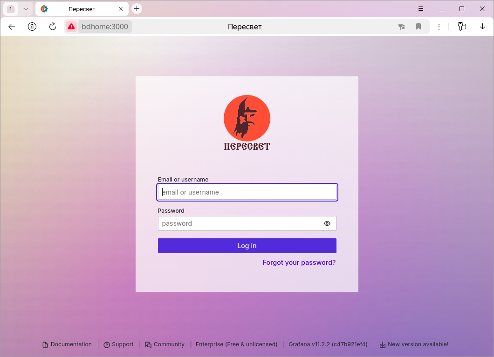
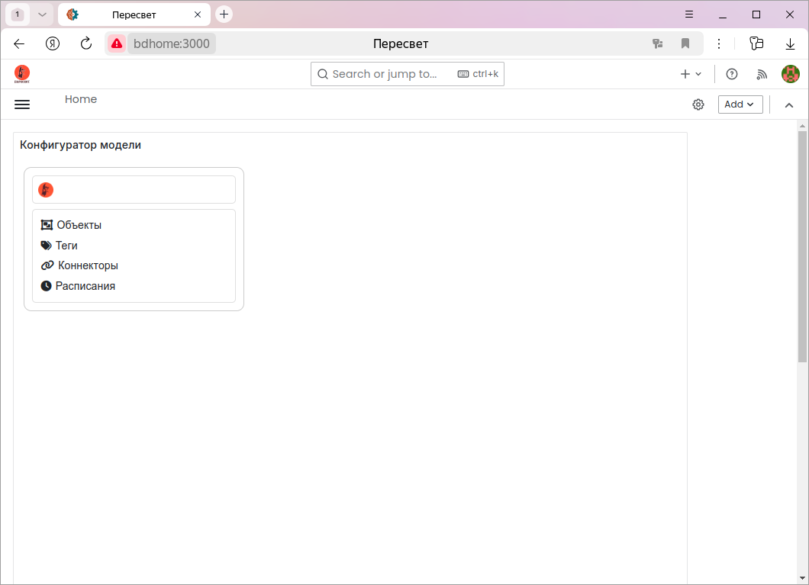
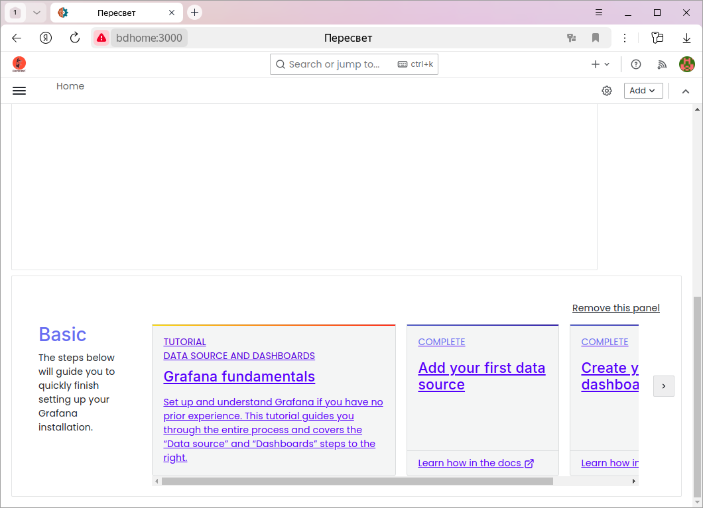
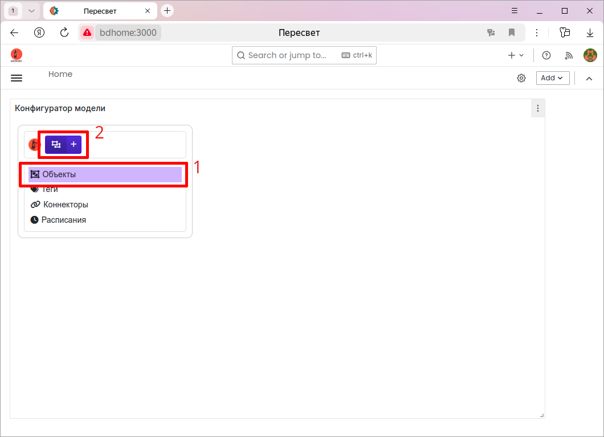
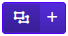
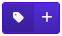
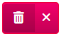
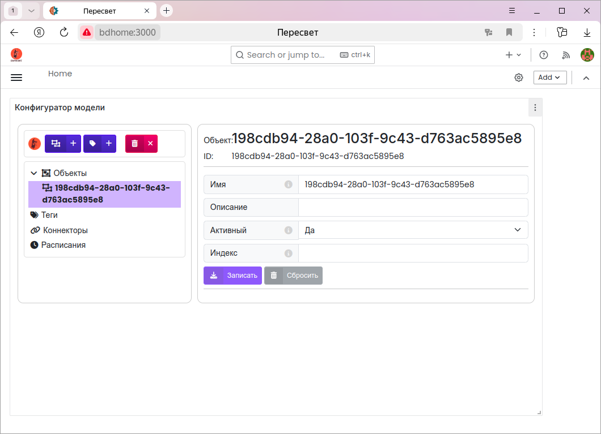
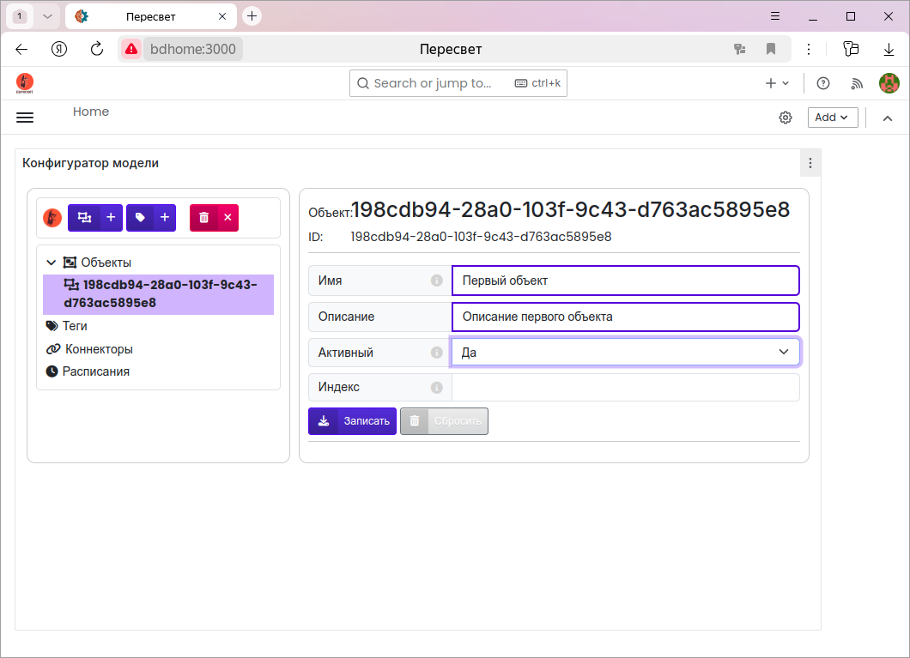
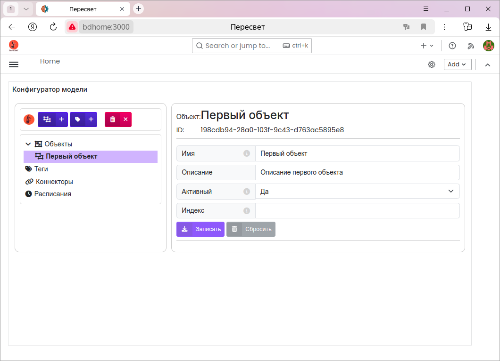

.. _configurator:

Конфигуратор модели
-------------------

.. note::
   Конфигуратор работает с платформой через :ref:`API <api>`.
   Форматы всех команд создания/чтения/обновления/удаления узлов иерархии
   можно найти в документации по указанной ссылке.

Первый запуск
^^^^^^^^^^^^^
Запускаем платформу (:ref:`installation`).

Запускаем браузер и в строке адреса пишем: http://localhost/grafana.

При первом запуске вводим имя пользователя ``admin``, пароль также ``admin``.
Grafana предложит сменить пароль.

По умолчанию открывается экран с конфигуратором.

При первом запуске в низ экрана атоматически добавляется панель, которую можно удалить:

Настройки
^^^^^^^^^
Кнопка с шестерёнкой стоит в одной строке с логотипом «Пересвет» и прижата
к правому краю этой строки. По нажатию открывается окно настроек.

**Привязка тегов и тревог к хранилищу по умолчанию при создании.**
Если флажок включён, новый тег или новая тревога привязываются к хранилищу,
отмеченному как хранилище по умолчанию. Если флажок снят, узел создаётся
без этой привязки. Значение запоминается в браузере.

**Сортировка узлов по алфавиту.**
Сначала узлы группируются по типу: объекты, затем теги, тревоги, методы,
коннекторы, расписания и хранилища. Пока флажок снят, внутри одного типа
узлы остаются в порядке платформы, по атрибуту ``prsIndex``. Если флажок
включён, внутри типа конфигуратор сортирует узлы по имени. Значение
запоминается в браузере и применяется к уже раскрытым веткам.

Папки модели
^^^^^^^^^^^^
Создаваемая модель объекта и информационной системы имеет иерархическую структуру.

На верхнем уровне иерархии находятся узлы, в которых создаются экземпляры соответствующих 
:ref:`сущностей <entity>`.

Проще освоить работу с конфигуратором на :ref:`примерах <examples>`.

Объекты
_______
Внутри этой папки создаётся основная иерархия - модель объекта. Иерархия имеет любой уровень 
вложенности и может включать в себя объекты, теги, тревоги, методы.

Теги
____
Наиболее простой случай модели объекта - это линейный список его параметров (тегов).

В таком случае теги можно создавать, не привязывая их к какому-либо объекту.

Для этого случая служит отдельная папка ``Теги``.

Коннекторы
__________
В этой папке создаются описания :ref:`коннекторов <definition_connector>`.
Параметры, задаваемые в узле-описании коннектора, зависят от конкретного коннектора.

Расписания
__________
Папка для создания расписаний - генераторов событий.

Хранилища данных
________________
Папка, в которой хранятся описания хранилищ данных. 
Исторические данные, факты возникновения, пропадания
и квитирования тревог хранятся в этих хранилищах.

.. note:: Открытая версия платформы "Пересвет" поддерживает работу только с одним хранилищем, 
   поэтому в конфигураторе для открытой платформы отсутствует узел "Хранилища данных".

Создание новых узлов
^^^^^^^^^^^^^^^^^^^^
1. Выбираем нужный узел, внутри которого хотим создать дочерний.
2. Выбираем нужную синюю кнопку и, нажав её, создаём новый экземпляр необходимой нам сущности.

После нажатия кнопки в иерархию добавится новый экземпляр выбранной сущности.
Узел в иерархии, соответствующий данному экземпляру, станет текущим и справа появится панель
со свойствами нового узла.

Кроме того, изменится набор кнопок в верхней части конфигуратора.

**Синие кнопки** показывают, экземпляры каких сущностей могут быть созданы внутри выбранного узла.

Например: внутри объекта могут быть созданы другие объекты или теги; внутри тега могут быть созданы 
методы и тревоги.

   
   Новый объект

   
   Новый тег

   
   **Красная кнопка** - удаление выбранного узла из иерархии.

При создании нового узла в иерархии с помощью конфигуратора он создаётся с параметрами по умолчанию.
Поэтому имя нового узла совпадает с его идентификатором.

Редактирование свойств узла
^^^^^^^^^^^^^^^^^^^^^^^^^^^
На панели справа редактируем свойства узла. При этом изменённые свойства обводятся синей рамкой.

Если у узла изменено хотя бы одно свойство, то активизируются две кнопки:

**Записать** - сохранение в модели изменённых свойств и

**Сбросить** - отмена внесённых изменений, возврат к начальным параметрам.

Нажимаем кнопку **Записать**:

Экспорт данных тега в CSV
^^^^^^^^^^^^^^^^^^^^^^^^^^
На вкладке **Запрос на чтение** ключи ``start`` и ``finish`` принимают целое
число микросекунд или строку даты и времени. В строку можно вставить значение
из колонки **Время** таблицы данных и значение из соседнего поля. Кнопка
сброса очищает поле. Кнопка календаря подставляет выбранные дату и время
строкой с часовым поясом.

Для тега на вкладке **Запрос на чтение** выполните запрос кнопкой
**Получить данные**. После успешного ответа станет доступна кнопка
**Сохранить в CSV**. Успешным считается HTTP-ответ с кодом ``2xx`` и
корректным JSON. Пустой список данных также можно экспортировать. Ошибка HTTP
или JSON либо новый запрос сразу очищают предыдущую таблицу и блокируют экспорт.

Имя файла по умолчанию: ``<имя тега> :: <текущая метка времени>.csv``.
Метка времени берётся в момент сохранения и записывается в локальном часовом
поясе. Внутри файла ``.csv`` сначала идут имя тега, его id и полная строка запроса
(``GET`` и URL). Затем идут ключи запроса и их значения. После заголовка
``x,y,q`` записываются точки ответа. Если в запросе был ключ ``format``,
метки времени ``x`` попадают в файл строками ISO 8601. Если ключ снят,
``x`` записывается целым числом микросекунд, как в ответе платформы.

Кнопка относится только к последнему успешному запросу. При изменении тега или
любого параметра snapshot очищается, таблица удаляется, а экспорт блокируется
до следующего успешного запроса.

Полный URL и ключи запроса записываются в файл буквально. Не помещайте секреты
в query parameters. Если URL содержит userinfo или в URL/параметрах обнаружены
ключи ``token``, ``api_key``, ``apikey``, ``password``, ``secret``,
``authorization``, ``access_token``, ``client_secret``, ``x-api-key`` или
``auth`` без учёта регистра, конфигуратор потребует явного подтверждения перед
скачиванием.

Запись значения тега
^^^^^^^^^^^^^^^^^^^^
На вкладке **Запрос на запись** указывается значение и, при необходимости, метка
времени. Перед отправкой значение приводится к типу тега: целое число,
вещественное число, строка или JSON. Пустая метка означает текущий момент.
Заполненная метка может быть
целым числом микросекунд или строкой даты и времени; она передаётся в
``POST /v1/data/`` первым элементом точки ``[x, y]``. Кнопка календаря рядом
с полем подставляет выбранные дату и время строкой с часовым поясом.

Удаление узла
^^^^^^^^^^^^^
Выбираем нужный узел в иерархии и нажимаем красную кнопку.
Удаление, копирование и приостановка просят подтверждение в окне
с жёлтым треугольником и восклицательным знаком.

Из иерархии удаляется узел и все его потомки.

Примеры
^^^^^^^
Работу в конфигураторе с отдельными сущностями проще освоить на :ref:`примерах <examples>`.