.. _historical_data:

Исторические данные
-------------------
Одна из главных задач Платформы - обеспечение клентов сохранёнными
историческими данными.
Клиенты получают данные с помощью запроса ``GET`` по адресу ``/v1/data/``.
Эта команда будет подробно объяснена ниже.

.. _timeStampFormat:

Правила работы с данными
^^^^^^^^^^^^^^^^^^^^^^^^

.. important::
  **При работе с историческими данными запомним следующие правила:**

  #. Для правильной работы с историческими данными все сервера, устройства,
     клиенты должны быть синхронизированы по времени.
  #. Если в тэге нет значений с метками времени из будущего, то последнее
     сохранённое на текущий момент времени в тэге значение является
     текущим значением тэга.
  #. Если значения тэга числовые:

     #. Если атрибут тэга ``prsStep`` равен ``true``, тогда значения тэга
        между двумя метками времени не интерполируются.
     #. Если атрибут тэга ``prsStep`` равен ``false`` (по умолчанию),
        тогда значения тэга между двумя метками времени вычисляются
        с помощью линейной интерполяции.
     #. Программы, предоставляющие данные пользователям, ответственны за
        верную интерпретацию атрибута ``prsStep`` у тэга.
        К примеру, тренд должен правильно показывать значения тэга
        между соседними метками времени.
  #. Все метки времени внутри платформы и в исторической базе данных
     хранятся и обрабатываются как целочисленные данные.
     Каждая метка времени - это количество микросекунд, начиная с
     01-01-1970 00:00:00+00:00.
     Пример: 1000000 = 01-01-1970 00:00:01+00:00
  #. Если клиент посылает в платформу метку времени как строку в формате
     ISO 8601 и не указывает временнУю зону, то Платформа устанавливает для
     такой метки времени зону по умолчанию UTC (+00:00).
  #. Клиенты могут записывать значения тэгов с метками времени из будущего.
  #. Ответ на запрос ``GET`` ``/v1/data/`` содержит массив значений тэга,
     отсортированный по метке времени в возрастающем порядке.
  #. Если тэг содержит несколько значений на одну и ту же метку времени,
     то текущим значением тэга на эту метку времени считается записанное
     последним.
  #. Каждое значение в тэге содержит код качества ``q``. Если ``q`` = 0
     или ``null``, то значению тэга можно доверять.
     Иначе значение тэга ошибочно, код
     ``q`` определяет ошибку. См. :ref:`коды качества <qualityCodes>`.

     Следующие правила касаются ключей ``count``, ``start``, ``finish`` и ``timeStep``
     в запросе ``GET`` ``/v1/data/``.

  #. Комбинации ключей ``start``, ``finish`` и ``timeStep`` совместно с ключом
     ``count`` определяют границы периода для возвращаемых данных.
  #. Ключ ``count`` определяет количество возвращаемых данных.
     Учитывается общее количество: и реально записанные в базе данных, и
     интерполированные значения тэгов.
  #. В случае отсутствия ключа ``finish`` его значение принимается равным
     текущему моменту времени.
     Это правило по умолчанию отсекает данные, записанные с метками времени
     из будущего.

.. _qualityCodes:

Коды качества
^^^^^^^^^^^^^
У каждого записанного в базу значения тэга есть так называемый "код качества",
который возвращается в ключе ``q``.

Код качества - это, другими словами, код ошибки данных.

.. list-table:: Коды качества
   :widths: 20 40
   :header-rows: 1

   * - Код
     - Описание
   * - 0 | null
     - Обычное значение. Данные "хорошие".
   * - 100
     - Разорвана связь между платформой и коннектором, записывающим данные
       в тэг. Используется совместно со значением тэга ``null``.
   * - 101
     - Установлена (или восстановлена) связь между коннектором и платформой
       после состояния 100. Используется совместно со значением тэга ``null``.
   * - 102
     - Разорвана связь между коннектором и поставщиком данных.
       Используется совместно со значением тэга ``null``.
   * - 103
     - Ошибка источника данных.
   * - 104
     - Зарезервировано (ранее использовалось как «восстановлена связь»;
       больше не применяется в новых версиях платформы).

.. _video_tag:

Видеопоток (тег типа 6)
^^^^^^^^^^^^^^^^^^^^^^^
Как завести камеру в конфигураторе, описано в :ref:`video_cameras`.
Ниже — контракт чтения, архива и управления.

Тег с ``prsValueTypeCode = 6`` — окно в камеру, а не ряд чисел.
Кадры не пишутся в RabbitMQ, VictoriaMetrics и PostgreSQL.
Камера заводится как обычный коннектор: адрес потока, каталог архива
и срок хранения лежат ключами в уже существующем атрибуте ``prsJsonConfigString``.
Новых атрибутов LDAP для этого нет.

Пример конфигурации коннектора:

.. code-block:: json

   {
     "rtspUrl": "rtsp://192.168.1.72:554/live/ch00_0",
     "rtspTransport": "tcp",
     "archivePath": "/var/lib/peresvet/video/rear-cam",
     "retentionHours": 24,
     "archiveWidth": null,
     "archiveFps": null,
     "onvifPort": 8899,
     "onvifUser": "",
     "onvifPassword": ""
   }

``rtspUrl`` обязателен и должен быть адресом ``rtsp://`` или ``rtsps://``.
Наличие этого ключа и делает коннектор камерой.
``archivePath`` — абсолютный путь. В контейнере видеосервера смонтирован
том ``/var/lib/peresvet/video``; каталог вне этого тома не переживёт
перезапуск контейнера. Если ключ опущен, архив пишется в
``{VIDEO_ARCHIVE_DIR}/{id коннектора}``.
``retentionHours`` — срок хранения в часах; если ключ опущен, берётся 24.
``archiveWidth`` — ширина картинки архива в пикселях, чётное число.
Высота подстраивается под пропорции кадра. ``null`` или пустое значение
означает ширину, которую отдаёт камера.
``archiveFps`` — частота кадров архива. ``null`` или пустое значение
означает частоту камеры.
Пустые ``onvifUser`` и ``onvifPassword`` означают, что камера логин не требует.
Транспорт по умолчанию TCP. Его можно задать ключом ``rtspTransport``
со значением ``tcp`` или ``udp``.
Управление камерой идёт по OnVif, отдельным запросом, без второго
подключения RTSP. Хост берётся из ``rtspUrl``, порт по умолчанию 8899
(ключ ``onvifPort``). Если камера требует логин, его задают ключами
``onvifUser`` и ``onvifPassword``. В блоке «Данные тега» кнопки
стоят слева от картинки. Стрелки двигают камеру, пока их держат.
«Ближе» и «Дальше» делают один шаг зума. «Стоп» останавливает
поворот и наклон сразу. «Домой» возвращает камеру по уже сделанным
с этой страницы движениям и снимает накопленный зум: сама камера
положение не запоминает.
Под стрелками камера показывает параметры изображения, которые сама
отдаёт по OnVif: яркость, контраст, насыщенность, резкость, засветка,
динамический диапазон, ИК-фильтр (день, ночь, авто) и баланс белого.
Ползунок или список отправляет на камеру только изменённый параметр.
Камера может ответить успехом и при этом не изменить кадр: прошивка
принимает зум и параметры изображения, сохраняет числа и не применяет
их к объективу. Поворот и наклон при этом могут работать.

Снаружи конфигуратора то же управление — ``POST /v1/ptz/``, тело JSON.
Обязателен ``tagId`` тега видеопотока. Поле ``action``:

* ``status`` — профиль, ``pan``, ``tilt``, ``zoom`` и список пресетов.
  То же делает ``GET /v1/ptz/?tagId=<id>``.
* ``move`` — непрерывный поворот, пока не придёт ``stop`` или не истекут
  8 секунд таймаута команды. ``pan``, ``tilt`` и ``zoom`` от −1 до 1.
* ``step`` — один относительный сдвиг с теми же тремя полями.
* ``pulse`` — шаг зума. Знак ``zoom`` задаёт направление, на камеру уходит ±1.
* ``stop`` — остановить текущий поворот и наклон.
* ``home`` — пройти назад движения, посланные с момента старта процесса
  видеосервера, затем вызвать домашнее положение камеры.
* ``preset`` — перейти к пресету, поле ``token`` или ``preset``.
* ``image`` — текущие параметры изображения и допустимые значения.
* ``image_set`` — записать параметры: ``brightness``, ``contrast``,
  ``saturation``, ``sharpness`` (числа), ``backlight`` и
  ``wideDynamicRange`` (``ON`` или ``OFF``), ``irCut``
  (``ON``, ``OFF``, ``AUTO``), ``whiteBalance`` (``AUTO`` или ``MANUAL``).

Ошибка управления приходит тем же JSON ``error.code`` и ``error.message``.
Чужой тег — 422, выключенный тег — 409, тег без камеры — 424,
камера отклонила команду — 502.

Тег типа «Видеопоток» привязывается к этому коннектору на вкладке коннектора
и не кладётся в хранилище истории.

Чтение
______
``GET /v1/data/?tagId=<id>`` для такого тега отдаёт не JSON-точки, а медиа:

* без ``start`` и ``finish`` — живой поток ``multipart/x-mixed-replace`` (MJPEG);
* только ``finish`` — снимок ``image/jpeg`` на этот момент;
  если фрагмента на это время нет, ответ ``404`` без картинки;
* ``start`` и ``finish`` — фрагмент ``video/mp4`` за период.

Ключи ``timeStep`` и ``count`` для видеопотока пока не поддерживаются.
На одну камеру держится один сеанс RTSP в контейнере видеосервера.
Смотрящих может быть несколько: платформа проверяет право чтения тега
и проксирует запрос на видеосервер, а тот раздаёт один и тот же сеанс.

В дашборде Grafana тот же URL можно поставить в ```` (живой поток и снимок)
или в ``<video>`` (фрагмент).

Метки ``start`` и ``finish`` — микросекунды или дата ISO 8601.
Для видеотега отсутствие обеих меток означает живой поток.
У остальных тегов отсутствие метки по-прежнему означает «сейчас».

Ошибки чтения
_____________
Тело ошибки — JSON ``{"error": {"code": ..., "message": "..."}}``, не картинка.

* 404 «Нет записи камеры на этот момент.» — на ``finish`` нет фрагмента.
* 404 «Нет записи камеры за этот период.» — между ``start`` и ``finish`` нет файлов.
* 409 «Тег видеопотока выключен.»
* 422 «Видеопоток читается по одному тегу за запрос.»
* 422 «Для видеопотока ключи timeStep и count пока не поддерживаются.»
* 422 «В периоде видеопотока finish должен быть позже start.»
* 422 «Слишком длинный видеофрагмент.» Период длиннее
  ``VIDEO_MAX_FRAGMENT_SECONDS``, по умолчанию 7200 секунд.
* 424 «Тег видеопотока не привязан к активному коннектору-камере.»
* 502 — камера или ffmpeg не отдали кадр или фрагмент.
* 503 «Не найден ffmpeg.»

Фрагмент
________
``start`` и ``finish`` не отдают готовый файл с диска. Видеосервер
находит покрывающие период фрагменты MPEG-TS, склеивает их и
перекодирует в один ``video/mp4`` (H.264, preset ``ultrafast``).
На сборку даётся 180 секунд. Пока она идёт, страница ждёт тело ответа:
в конфигураторе это надпись «Загрузка…».

Своя HTML-страница
__________________
Если ``tagId`` известен заранее, живой поток ставится в ``img``.
Браузер показывает ``multipart/x-mixed-replace`` кадр за кадром и не ждёт
конца ответа.

.. code-block:: html

   

Страницу открывают с того же хоста, что и платформу: путь ``/v1/data/``
уже проксируется nginx. В атрибут ``src`` нельзя подставить заголовок
авторизации. При включённой авторизации браузер отправит только куку
этого хоста, поэтому страница должна быть на нём же.
Если перед картинкой стоит свой прокси, для ``/v1/data/`` отключают
буферизацию ответа. Иначе живой поток приходит одним куском или с
большой задержкой.

Остановить просмотр в браузере — убрать адрес. Запись архива при этом
продолжается:

.. code-block:: javascript

   document.querySelector("#cam").removeAttribute("src");

Снимок на момент — тот же адрес с ``finish``. Знак плюс в часовом поясе
кодируется как ``%2B``:

.. code-block:: html

   

Если записи нет, ответ — JSON, и тег ``img`` остаётся пустым.
Текст ошибки тогда читают отдельным ``fetch`` по тому же адресу.

Фрагмент за период — тег ``video``. Картинка появится после сборки mp4:

.. code-block:: html

   <video controls
          src="/v1/data/?tagId=67bde18c-5431-1041-925c-470278307e33&amp;start=2026-10-05T18:36:00%2B03:00&amp;finish=2026-10-05T18:37:00%2B03:00">
   </video>

``fetch`` живого потока без чтения тела по частям не завершается.
Клиент вроде Advanced REST Client остаётся на строке «получены заголовки».

Просмотр в конфигураторе
________________________
У тега типа 6 блок «Данные тега» открыт и без привязки к хранилищу истории.
Кнопка с иконкой воспроизведения читает тег по тем же правилам, что и ``GET /v1/data/``:

* пустые ``start`` и ``finish`` — живой поток;
* только ``finish`` — снимок;
* ``start`` и ``finish`` — фрагмент за период.

Пока картинка или поток открыты, та же кнопка меняет иконку на паузу
и закрывает просмотр в браузере. Запись архива при этом не останавливается:
сеанс с камерой держит видеосервер, а не открытая страница.

Частота кадров просмотра
________________________
8 кадров в секунду — это не частота камеры. Для картинки в браузере
видеосервер принудительно оставляет 8 кадров в секунду и ширину 960 пикселей
(MJPEG). Так сервер с небольшим объёмом памяти успевает и показывать,
и писать архив. Полный кадр камеры в двух кодированиях сразу на машине
с 2 ГБ памяти процесс убивал.

В архив по умолчанию пишется картинка камеры целиком: её ширина и её
частота кадров, кодеком H.264 (preset ``ultrafast``). Уменьшить архив
можно ключами ``archiveWidth`` и ``archiveFps`` в конфигурации коннектора.
Битрейт архива от сюжета и от этих ключей зависит и заранее не фиксируется:
его нужно померить по уже записанным файлам.

Просмотр на диск не пишется. Один зритель при текущих настройках
забирает по сети порядка 8 Мбит/с. Кодирование одно на камеру,
сколько бы страниц ни было открыто.

Диск и мощность видеосервера
____________________________
Объём архива одной камеры:

.. code-block:: text

   ГБ ≈ часы_хранения × битрейт_Мбит/с × 0,44

Множитель 0,44 — это перевод Мбит/с в гигабайты за час:
``3600 / 8 / 1024``. На несколько камер результат умножается на их число.

По камере с ключом ``archiveWidth`` 640 измеренный поток около 1,15 Мбит/с,
то есть около 492 МБ в час. При ``retentionHours`` 24 это около 12 ГБ
на эту камеру. Пока сеанс перезапускается, в часе бывают пустые промежутки,
и фактический объём чуть меньше расчётного.

Мощность видеосервера считается по числу камер, не по числу зрителей.
На каждую камеру один процесс: приём RTSP, запись архива и подготовка
просмотра. Сеть видеосервера растёт отдельно, примерно на 8 Мбит/с
на каждого зрителя живого потока. Перед добавлением следующей камеры
смотрите загрузку контейнера ``prs-video``. Если память подходит к пределу,
камер должно быть меньше либо картинка архива ещё уже.

Архив на диске
______________
Архив — это фрагменты MPEG-TS. Каталог берётся из ``archivePath``
коннектора. У камеры с путём ``/var/lib/peresvet/video/rear-cam``
файлы лежат там, внутри тома контейнера видеосервера.
Имя файла — время начала фрагмента в секундах Unix, например ``1791117621.ts``.

Номинальная длина фрагмента — ``VIDEO_SEGMENT_SECONDS``, по умолчанию 10 секунд.
Если сеанс с камерой перезапускался, промежуток между соседними файлами
бывает длиннее. Файлы старше ``retentionHours`` удаляются, когда коннектор
сохраняют, и затем примерно раз в 20 секунд, пока сеанс с камерой жив.
Тот же 20-секундный обход заново читает конфигурацию всех камер, если
сообщение брокера о правке не дошло.

Список фрагментов:

.. code-block:: bash

   docker exec prs-video ls -lh /var/lib/peresvet/video/rear-cam

Посмотреть запись из конфигуратора: у тега задайте ``start`` и ``finish``
и нажмите кнопку воспроизведения. Плеер получит один mp4 за этот период,
склеенный из покрывающих его фрагментов.

Изменение коннектора
____________________
Сохранение коннектора в конфигураторе публикует в брокер сообщение
``prsConnector.model.updated.<id>``. Видеосервер подписан на создание,
изменение и удаление коннектора так же, как остальные сервисы этой
сущности. Голос на саму правку он отдаёт разрешающий: сохранить
коннектор можно и пока видеосервер применяет новую конфигурацию.
По сообщению сервер заново читает ``prsJsonConfigString``. Новый
``rtspUrl``, ``archivePath``, ``rtspTransport``, ``archiveWidth`` или
``archiveFps`` открывают сеанс заново. Новый ``retentionHours``
применяется сразу: лишние фрагменты удаляются, а поток с камеры
не переоткрывается.

Индикатор в дереве
__________________
Кружок у коннектора зелёный, пока на брокере есть MQTT-сессия с ClientId,
равным id этого коннектора. Для камеры такую сессию открывает видеосервер
на время живого сеанса RTSP и закрывает её, когда сеанс останавливается.
В теги камеры при этом не пишутся коды качества 100 и 101, и полная
конфигурация коннектора на камеру не отправляется.

Получение данных
^^^^^^^^^^^^^^^^
Подробно рассмотрим примеры получения исторических данных.

Пример массива данных
_____________________
Допустим, у нас есть тэг ``Tag1`` у объекта ``Object1``. Идентификатор тега - ``1500c712-726a-103e-9264-a5021ec2dae1``.
Атрибут ``prsTagValueTypeCode`` этого тэга равен 1 и это значит, что тэг
хранит вещественные значения.
Исторические данные этого тэга:

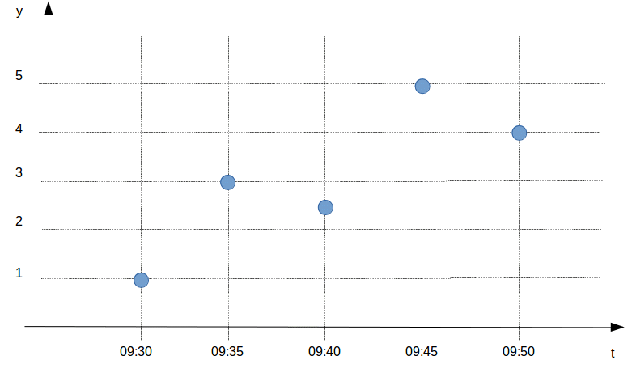

.. note::
  Для простоты будем оперировать только часами и минутами в качестве меток
  времени.

Итак, исторические данные тэга ``Tag1``:

.. code-block:: json

   [
     ["09:30", 1],
     ["09:35", 3],
     ["09:40", 2.5],
     ["09:45", 5],
     ["09:50", 4]
   ]

Формат запроса на получение данных
__________________________________
Пример:

.. code-block:: json

   {
     "tagId": ["id первого тэга", "id второго тэга"],
     "start": "2018-12-09 12:00:00+03:00",
     "finish": "2018-12-09 14:00:00+03:00",
     "count": 8,
     "timeStep": 60000000,
     "maxCount": 700,
     "actual": false,
     "format": true,
     "value": 10
   }

* **tagId** (str или массив из str), обязательный -
  тэг(и) для которых необходимо получить данные.

* **start** (int, str), необязательный - метка времени начала периода
  для получения данных (:ref:`see <timeStampFormat>`).
  Если ``start`` - строка, то ее значение обрабатывается в соответствии со
  стандартом `ISO 8601 <https://en.wikipedia.org/wiki/ISO_8601>`_.

  Возможные значения:

  * **"2018-12-20 00:00:00+03:00"**
  * **"2018-12-20 00:00:00"** - временнАя зона для этого значения
    будет установлена в UTC (00:00)
  * **1544662830000000** значение равно:
    "2018-12-13 01:00:30+00:00"
  * **"01:00"** предположим, что текущая дата на сервере платформы -
    2018-12-20, тогда "01:00" будет преобразовано в "2018-12-20 01:00:00+00:00"
  * **"01:00,5+03:00"** равно (оставим предыдущее предположение о дате)
    "2018-12-20 01:00:30+3:00"
  * другие примеры указания времени можно посмотреть на
    `странице стандарта ISO 8601 <https://en.wikipedia.org/wiki/ISO_8601>`_

* **finish** (int, str), необязательный - метка времени конца периода,
  соответствует тем же правилам, что и ключ ``start``.
* **count** (int), необязательный - количество значений, ожидаемых в ответе
* **timeStep** (int), необязательный - промежуток времени между соседними
  возвращаемыми значениями тэга
* **maxCount** (int), необязательный - ключ используется, в основном, виджетами
  и принимает значение ширины виджета в пикселях. Таким образом, Платформа
  знает, что виджет не может показать больше значений, чем указано в
  ``maxCount``. В этом случае платформа возвращает не больше значений, чем
  указано в ``maxCount``.

  Ключ ``maxCount`` предотвращает излишнюю загрузку платформы при работе
  с большими массивами данных.
* **format** (любой тип и значение), необязательный -
  если этот ключ присутствует и не равен ``None``, тогда метки времени
  возвращаются в виде строк в формате ISO 8601, часовая зона - зона сервера,
  на котором работает платформа.
* **actual** (bool), необязательный -
  если этот ключ присутствует и установлен в ``true``,
  тогда в ответе на запрос присутствуют только реальные записанные базу данных
  значения тэга.
* **value** (any), необязательный - фильтр значений тега.

Формат ответа на запрос на получение данных
___________________________________________
Пример:

.. code-block:: json

   {
      "data": [
        {
          "exceed": false,
          "tagId": "id тега",
          "data": [
            ["2018-12-31T00:00:00+03:00", 1, null],
            ["2018-12-31T00:01:00+03:00", 120, null]
          ]
        }
      ]
   }

Если запрос выполнен без ошибок, ответ всегда содержит один ключ - ``data``,
который является массивом элементов типа json, каждый элемент - данные по одному
тегу из запроса.

Ключи элемента из массива:

* **exceed** (bool) - флаг того, что данных в архиве больше, чем запрошено;
  логика работы флага: если в запросе указан ключ :ref:`maxCount <maxCount>`,
  то в ответе устанавливается флаг ``exceed``; если этот флаг = ``true``, то
  это означает, что в архиве содержится больше значений, чем указано в запросе в ключе
  ``maxCount``, поэтому возвращённые значения тега усреденены и лучший выход -
  изменить запрос, запросив меньшее количество значений тега; если в запросе нет ключа
  ``maxCount``, то ключ ``exceed`` в ответе отсутствует;
* **tagId** (str) - идентификатор тега;
* **data** (массив массивов) - массив значений, попадающих в запрошенный период;
  каждый элемент массива - в свою очередь, тоже массив и состоит из трёх элементов:
  ``[x, y , q]``, где:

  ``x`` - метка времени, с которой записано значение тега;
  ``y`` - значение тега;
  ``q`` - код :ref:`качества значения <qualityCodes>`.

.. note::
  В более ранних версиях платформы порядок мог встречаться как
  ``[y, x, q]``. Актуальный контракт — **всегда** ``[x, y, q]``:
  метка времени, значение, код качества.

Ниже - примеры запросов.

.. _getCurrentValue:

Получение текущего значения тэга
________________________________
Самый простой запрос на получение данных выглядит так:

.. code-block:: json

  {
    "tagId": "1500c712-726a-103e-9264-a5021ec"
  }

Запрос выше показывает, как можно получить текущее значение одного тэга.

Допустим, текущий момент времени - 09:53:

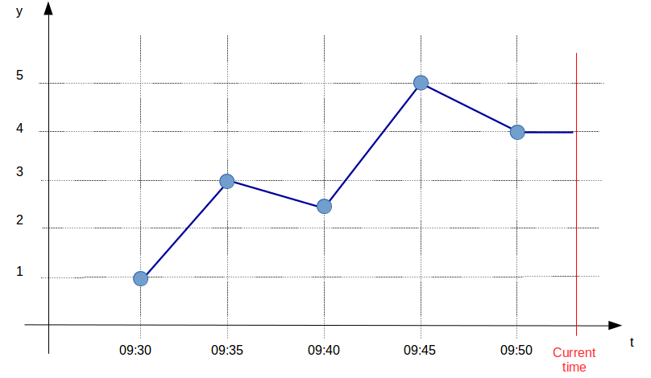

Ответом будет:

.. code-block:: json

  {
    "data": [
      {
        "tagId": "1500c712-726a-103e-9264-a5021ec2dae1",
        "data": [
          [1545288780000000, 4, null]
        ]
      }
    ]
  }

:ref:`В соответствии с правилом 2<timeStampFormat>` текущее значение тэга - 4.
Метка времени (``1545288780000000``) соответствует текущему моменту времени.
Такой ответ будет идентичен для тэгов с атрибутом ``prsStep``, равным
``true`` и ``false``.

.. note::
   #. Для простоты понимания меток времени во всех следующих запросах будем
      использовать ключ ``format``.
   #. Опять же для простоты исключим из всех дальнейших меток времени дату.

Метки времени в будущем и ``prsStep`` = false
_____________________________________________
Допустим, текущий момент времени 09:47:30.
Это значит, что мы имеем одно значение тэга, сохранённое с меткой времени
в будущем.
Пусть ``prsStep`` = ``false``, то есть мы должны интерполировать значения
тэгов.

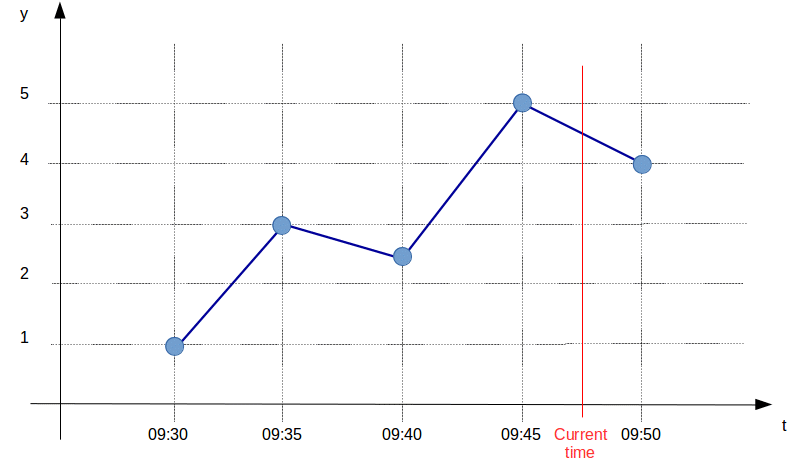

Тогда запрос

.. code-block:: json

  {
    "tagId": "1500c712-726a-103e-9264-a5021ec2dae1",
    "format": true
  }

Вернёт:

.. code-block:: json

  {
    "data": [
      {
        "tagId": "1500c712-726a-103e-9264-a5021ec2dae1",
        "data": [
          ["09:47:30", 4.5, null]
        ]
      }
    ]
  }

Метки времени в будущем, ``prsStep`` = true
___________________________________________
Этот пример отличается от предыдущего тем, что ``prsStep`` = ``true``.

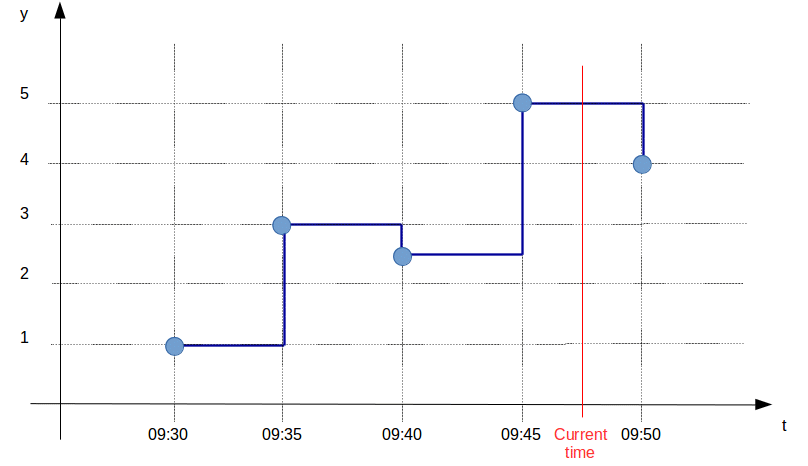

Тогда запрос

.. code-block:: json

  {
    "tagId": "1500c712-726a-103e-9264-a5021ec2dae1",
    "format": true
  }

Вернёт:

.. code-block:: json

  {
    "data": [
      {
        "tagId": "1500c712-726a-103e-9264-a5021ec2dae1",
        "data": [
          ["09:47:30", 5, null]
        ]
      }
    ]
  }

Ключ ``start``
______________
``prsStep`` = false
...................
Добавим к нашему запросу ключ ``start``.
Ключ ``start`` устанавливает начало периода для получения данных.
Пусть ``start`` = 09:32:30 и ``prsStep`` = ``false``.

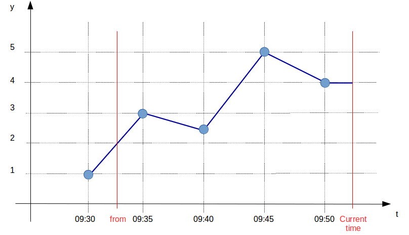

Запрос:

.. code-block:: json

  {
    "tagId": "1500c712-726a-103e-9264-a5021ec2dae1",
    "format": true,
    "start": "09:32:30"
  }

Ответ:

.. code-block:: json

  {
    "data": [
      {
        "tagId": "1500c712-726a-103e-9264-a5021ec2dae1",
        "data": [
          ["09:32:30", 2, null],
          ["09:35:00", 3, null],
          ["09:40:00", 2.5, null],
          ["09:45:00", 5, null],
          ["09:50:00", 4, null],
          ["09:53:00", 4, null]
        ]
      }
    ]
  }

``prsStep`` = ``true``
......................
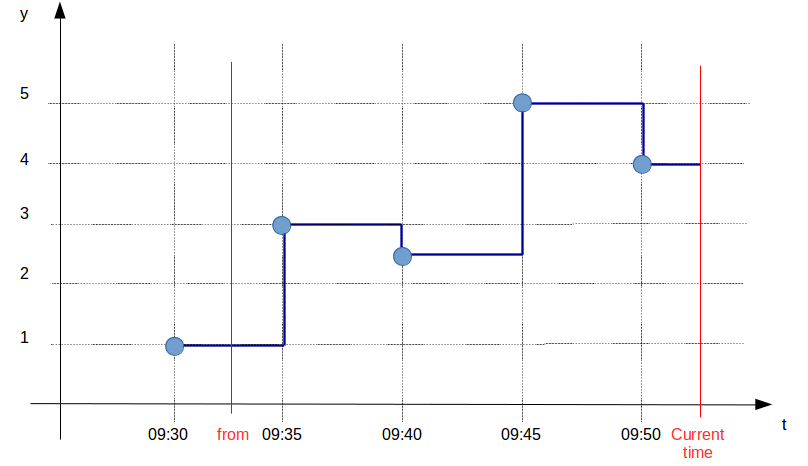

Запрос:

.. code-block:: json

  {
    "tagId": "1500c712-726a-103e-9264-a5021ec2dae1",
    "format": true,
    "start": "09:32:30"
  }

Ответ:

.. code-block:: json

  {
    "data": [
      {
        "tagId": "1500c712-726a-103e-9264-a5021ec2dae1",
        "data": [
          ["09:32:30", 1, null],
          ["09:35:00", 3, null],
          ["09:40:00", 2.5, null],
          ["09:45:00", 5, null],
          ["09:50:00", 4, null],
          ["09:53:00", 4, null]
        ]
      }
    ]
  }

Начало периода в запросе - перед любой меткой времени в базе
............................................................
Пусть ``start`` = 09:27:30.

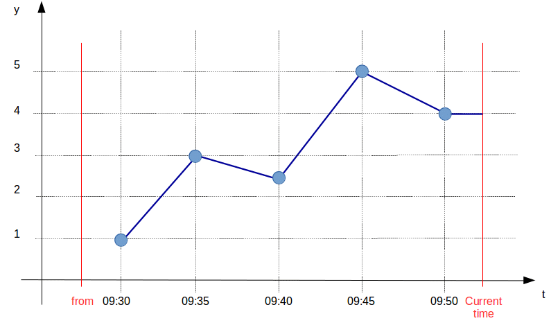

Запрос:

.. code-block:: json

  {
    "tagId": "1500c712-726a-103e-9264-a5021ec",
    "format": true,
    "start": "09:27:30"
  }

Ответ:

.. code-block:: json

  {
    "data": [
      {
        "tagId": "1500c712-726a-103e-9264-a5021ec2dae1",
        "data": [
          ["09:27:30", null, null],
          ["09:30:00", 1, null],
          ["09:35:00", 3, null],
          ["09:40:00", 2.5, null],
          ["09:45:00", 5, null],
          ["09:50:00", 4, null],
          ["09:53:00", 4, null]
        ]
      }
    ]
  }

Начало периода в запросе - после любой метки времени в базе
...........................................................
Пусть ``start`` = 09:52:30.

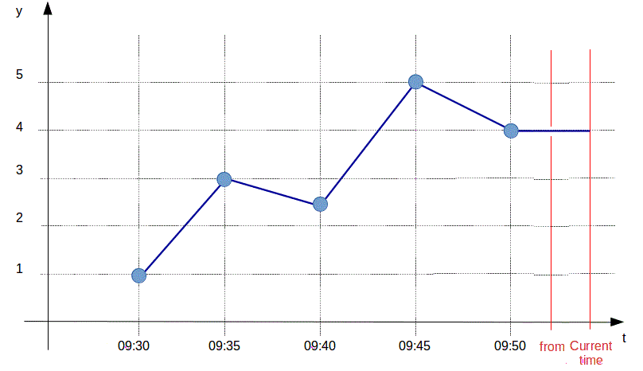

Запрос:

.. code-block:: json

  {
    "tagId": "1500c712-726a-103e-9264-a5021ec",
    "format": true,
    "start": "09:52:30"
  }

Возвращается последнее значение в базе как на метку ``start``, так и на текущую метку времени

Ответ:

.. code-block:: json

  {
    "data": [
      {
        "tagId": "1500c712-726a-103e-9264-a5021ec2dae1",
        "data": [
          ["09:52:30", 4, null],
          ["09:55:00", 4, null]
        ]
      }
    ]
  }

Ключ ``finish``
_______________
``finish`` = произвольной метке времени
.......................................
Устанавливая ключ ``finish``, мы ограничиваем конец периода получения данных.

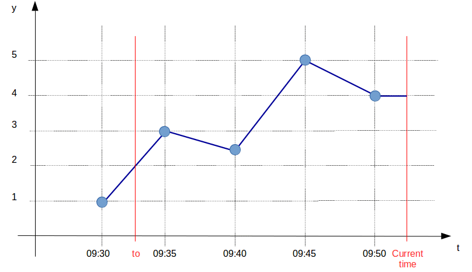

Запрос:

.. code-block:: json

  {
    "tagId": "1500c712-726a-103e-9264-a5021ec",
    "format": true,
    "finish": "09:32:30"
  }

Ответ:

.. code-block:: json

  {
    "data": [
      {
        "tagId": "1500c712-726a-103e-9264-a5021ec2dae1",
        "data": [
          ["09:32:30", 2, null]
        ]
      }
    ]
  }

Ключ ``finish`` установлен перед любой существующей в базе меткой времени
.........................................................................
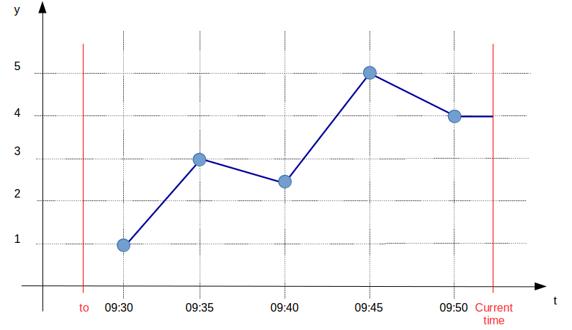

Запрос:

.. code-block:: json

  {
    "tagId": "1500c712-726a-103e-9264-a5021ec",
    "format": true,
    "finish": "09:27:30"
  }

Ответ:

.. code-block:: json

  {
    "data": [
      {
        "tagId": "1500c712-726a-103e-9264-a5021ec2dae1",
        "data": [
          ["09:27:30", null, null]
        ]
      }
    ]
  }

Ключ ``finish`` равен текущей метке времени
...........................................
Если мы установим ключ ``finish`` на текущую метку времени, то запрос
будет в точности таким же, как в запросе :ref:`getCurrentValue`.

Ключи ``start`` и ``finish``
____________________________
Ниже - несколько примеров одновременно установленных ключей ``start`` и ``finish``.

``start`` и ``finish`` внутри существующих в базе меток
.......................................................
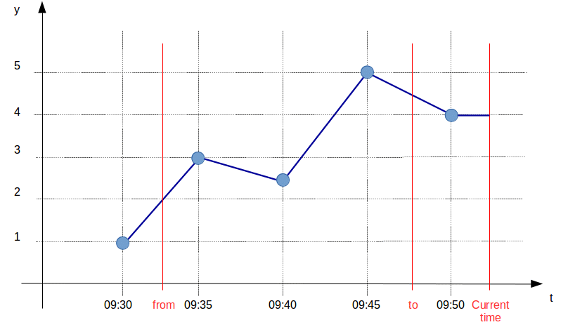

Запрос:

.. code-block:: json

  {
    "tagId": "1500c712-726a-103e-9264-a5021ec",
    "format": true,
    "start": "09:32:30",
    "finish": "09:47:30"
  }

Ответ:

.. code-block:: json

  {
    "data": [
      {
        "tagId": "1500c712-726a-103e-9264-a5021ec2dae1",
        "data": [
          ["09:32:30", 2, null],
          ["09:35:00", 3, null],
          ["09:40:00", 2.5, null],
          ["09:45:00", 5, null],
          ["09:47:30", 4.5, null]
        ]
      }
    ]
  }

``start`` выходит за пределы меток
..................................
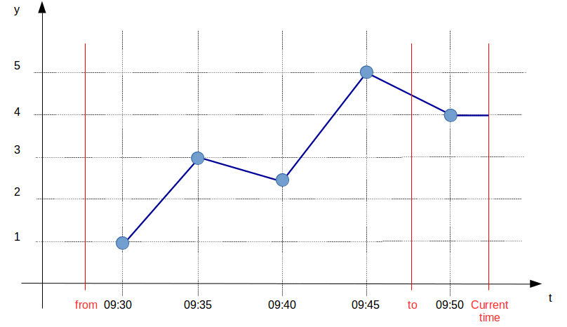

Запрос:

.. code-block:: json

  {
    "tagId": "1500c712-726a-103e-9264-a5021ec",
    "format": true,
    "start": "09:27:30",
    "finish": "09:47:30"
  }

Ответ:

.. code-block:: json

  {
    "data": [
      {
        "tagId": "1500c712-726a-103e-9264-a5021ec2dae1",
        "data": [
          ["09:27:30", null, null],
          ["09:30:00", 1, null],
          ["09:35:00", 3, null],
          ["09:40:00", 2.5, null],
          ["09:45:00", 5, null],
          ["09:47:30", 4.5, null]
        ]
      }
    ]
  }

``start`` и ``finish`` вне меток времени
........................................
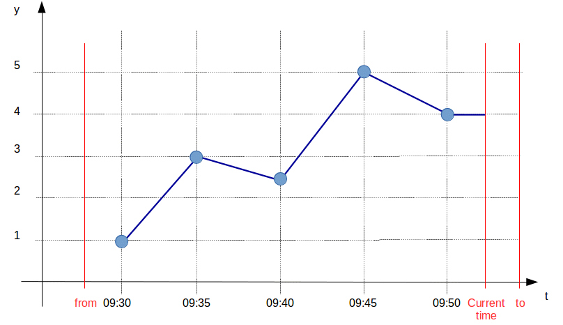

Запрос:

.. code-block:: json

  {
    "tagId": "1500c712-726a-103e-9264-a5021ec",
    "format": true,
    "start": "09:27:30",
    "finish": "09:55:00"
  }

Ответ:

.. code-block:: json

  {
    "data": [
      {
        "tagId": "1500c712-726a-103e-9264-a5021ec2dae1",
        "data": [
          ["09:27:30", null, null],
          ["09:30:00", 1, null],
          ["09:35:00", 3, null],
          ["09:40:00", 2.5, null],
          ["09:45:00", 5, null],
          ["09:50:00", 4, null],
          ["09:55:00", 4, null]
        ]
      }
    ]
  }

Ключ ``count``
______________
Ключ ``count`` определяет запрашиваемое количество данных.

В соответствии с :ref:`правилом 10<timeStampFormat>` ключ ``finish``
равен текущей метке времени в случае, если установлен только ключ ``count``.

Ключи ``count`` и ``finish``
............................
Предположим, что мы установили ключ ``finish`` на момент времени, не существующий
в базе данных:

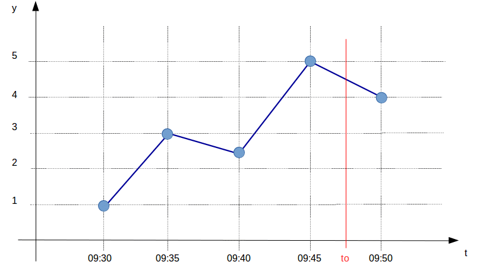

Запрос:

.. code-block:: json

  {
    "tagId": "1500c712-726a-103e-9264-a5021ec",
    "format": true,
    "finish": "09:47:30",
    "count": 3
  }

Этот запрос вернёт два сохранённых значения и одно интерполированное.

Ответ:

.. code-block:: json

  {
    "data": [
      {
        "tagId": "1500c712-726a-103e-9264-a5021ec2dae1",
        "data": [
          ["09:40:00", 2.5, null],
          ["09:45:00", 5, null],
          ["09:47:30", 4.5, null]
        ]
      }
    ]
  }

Следующий пример показывает, что мы получим в случае, если ключ ``finish``
равен существующей в базе метке времени:

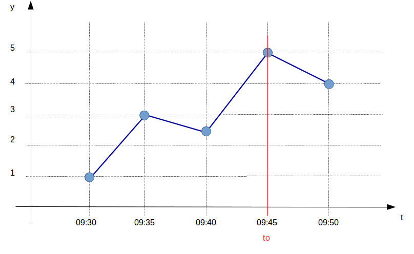

Запрос:

.. code-block:: json

  {
    "tagId": "1500c712-726a-103e-9264-a5021ec",
    "format": true,
    "finish": "09:45:00",
    "count": 3
  }

Запрос вернёт три сохранённых значения.

Ответ:

.. code-block:: json

  {
    "data": [
      {
        "tagId": "1500c712-726a-103e-9264-a5021ec2dae1",
        "data": [
          ["09:35:00", 3, null],
          ["09:40:00", 2.5, null],
          ["09:45:00", 5, null]
        ]
      }
    ]
  }

Запрос:

Ключ ``count`` превышает количество существующих значений
(основываемся на предыдущей картинке).

.. code-block:: json

  {
    "tagId": "1500c712-726a-103e-9264-a5021ec",
    "format": true,
    "finish": "09:45:00",
    "count": 5
  }

Ответ:

.. code-block:: json

  {
    "data": [
      {
        "tagId": "1500c712-726a-103e-9264-a5021ec2dae1",
        "data": [
          ["09:30:00", 1, null],
          ["09:35:00", 3, null],
          ["09:40:00", 2.5, null],
          ["09:45:00", 5, null]
        ]
      }
    ]
  }

Ключ ``finish`` превышает последнюю существующую метку времени:

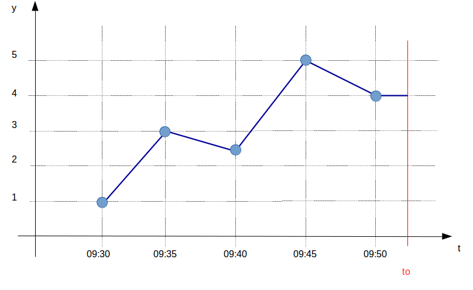

Запрос:

.. code-block:: json

  {
    "tagId": "1500c712-726a-103e-9264-a5021ec",
    "format": true,
    "finish": "09:52:30",
    "count": 3
  }

Будут возвращены два сохранённых и последнее существующее значение на метку времени ``finish``:

Ответ:

.. code-block:: json

  {
    "data": [
      {
        "tagId": "1500c712-726a-103e-9264-a5021ec2dae1",
        "data": [
          ["09:45:00", 5, null],
          ["09:50:00", 4, null],
          ["09:52:30", 4, null]
        ]
      }
    ]
  }

Ключи ``count`` и ``start``
...........................
Совместное использование ключей ``count`` и ``start`` похоже на случай
совместного использования ключей ``finish`` и ``count`` за исключением того,
что мы ограничиваем не конец периода, а начало.

Несколько следующих примеров основываются на следующей картинке:

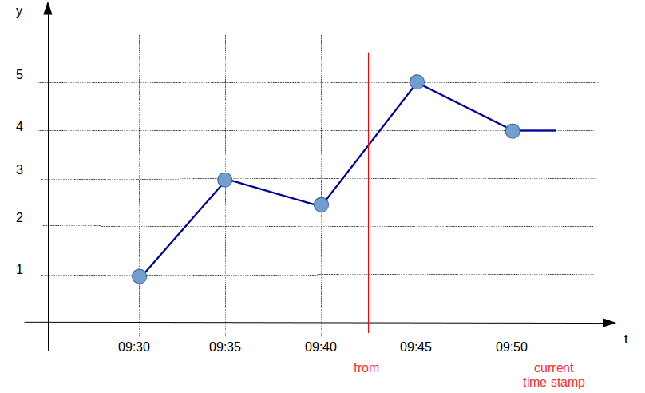

Запрос ``count`` = 1:

.. code-block:: json

  {
    "tagId": "1500c712-726a-103e-9264-a5021ec",
    "format": true,
    "start": "09:42:30",
    "count": 1
  }

Ответ:

.. code-block:: json

  {
    "data": [
      {
        "tagId": "1500c712-726a-103e-9264-a5021ec2dae1",
        "data": [
          ["09:42:30", 3.3, null]
        ]
      }
    ]
  }

Запрос ``count`` = 2:

.. code-block:: json

  {
    "tagId": "1500c712-726a-103e-9264-a5021ec",
    "format": true,
    "start": "09:42:30",
    "count": 2
  }

Ответ:

.. code-block:: json

  {
    "data": [
      {
        "tagId": "1500c712-726a-103e-9264-a5021ec2dae1",
        "data": [
          ["09:42:30", 3.3, null],
          ["09:45:00", 5, null]
        ]
      }
    ]
  }

Запрос ``count`` = 3:

.. code-block:: json

  {
    "tagId": "1500c712-726a-103e-9264-a5021ec",
    "format": true,
    "start": "09:42:30",
    "count": 3
  }

Ответ:

.. code-block:: json

  {
    "data": [
      {
        "tagId": "1500c712-726a-103e-9264-a5021ec2dae1",
        "data": [
          ["09:42:30", 3.3, null],
          ["09:45:00", 5, null],
          ["09:50:00", 4, null]
        ]
      }
    ]
  }

Запрос ``count = 4``:

.. code-block:: json

  {
    "tagId": "1500c712-726a-103e-9264-a5021ec",
    "format": true,
    "start": "09:42:30",
    "count": 4
  }

Ответ:

.. code-block:: json

  {
    "data": [
      {
        "tagId": "1500c712-726a-103e-9264-a5021ec2dae1",
        "data": [
          ["09:42:30", 3.3, null],
          ["09:45:00", 5, null],
          ["09:50:00", 4, null],
          ["09:52:30", 4, null]
        ]
      }
    ]
  }

Запрос ``count = 5``: ответ будет в точности таким же, как предыдущий.

Давайте переместим текущую метку времени:

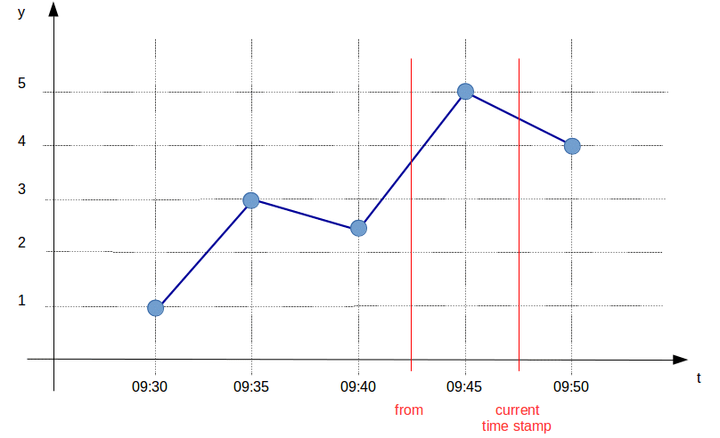

Запрос ``count`` = 3:

.. code-block:: json

  {
    "tagId": "1500c712-726a-103e-9264-a5021ec",
    "format": true,
    "start": "09:42:30",
    "count": 3
  }

Ответ:

.. code-block:: json

  {
    "data": [
      {
        "tagId": "1500c712-726a-103e-9264-a5021ec2dae1",
        "data": [
          ["09:42:30", 3.3, null],
          ["09:45:00", 5, null],
          ["09:47:30", 4.5, null]
        ]
      }
    ]
  }

Запрос ``count`` = 4: ответ будет таким же, как предыдущий в связи с
:ref:`правилом 10 <timeStampFormat>`, вне зависимости от того, что существует
значение с меткой времени в будущем (09:50:00).

Ключ ``timeStep``
_________________
Ключ ``timeStep`` устанавливает временнОй период между соседними возвращаемыми
значениями. Используйте этот ключ совместно с ключом ``count``.

Значения ключа ``timeStep`` измеряется в микросекундах.

``timeStep`` и ``count``
........................
Как определено в :ref:`правиле 2 <timeStampFormat>`, значение по умолчанию
ключа ``finish`` - текущая метка времени.

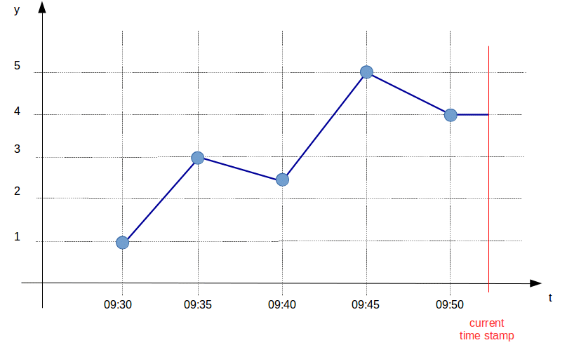

Запрос (``timeStep`` равен 5 минутам):

.. code-block:: json

  {
    "tagId": "1500c712-726a-103e-9264-a5021ec",
    "format": true,
    "timeStep": 300000000,
    "count": 3
  }

Ответ:

.. code-block:: json

  {
    "data": [
      {
        "tagId": "1500c712-726a-103e-9264-a5021ec2dae1",
        "data": [
          ["09:42:30", 3.7, null],
          ["09:47:30", 4.5, null],
          ["09:52:30", 4, null]
        ]
      }
    ]
  }

Теперь рассмотрим тот же запрос, но выполненный в момент времени ``10:05``:

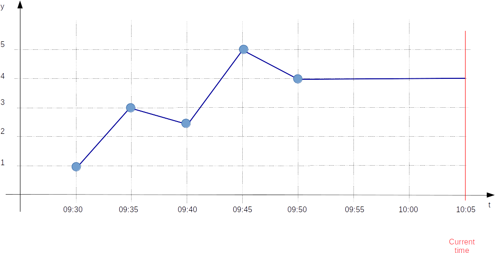

Запрос (``timeStep`` равен 5 минутам):

.. code-block:: json

  {
    "tagId": "1500c712-726a-103e-9264-a5021ec",
    "format": true,
    "timeStep": 300000000,
    "count": 3
  }

Ответ:

.. code-block:: json

  {
    "data": [
      {
        "tagId": "1500c712-726a-103e-9264-a5021ec2dae1",
        "data": [
          ["09:55:00", 4, null],
          ["10:00:00", 4, null],
          ["10:05:00", 4, null]
        ]
      }
    ]
  }

Запрос (``count`` = 6):

.. code-block:: json

  {
    "tagId": "1500c712-726a-103e-9264-a5021ec",
    "format": true,
    "timeStep": 300000000,
    "count": 6
  }

Ответ:

.. code-block:: json

  {
    "data": [
      {
        "tagId": "1500c712-726a-103e-9264-a5021ec2dae1",
        "data": [
          ["09:27:30", null, null],
          ["09:32:30", 2, null],
          ["09:37:30", 2.725, null],
          ["09:42:30", 3.3, null],
          ["09:47:30", 4.5, null],
          ["09:52:30", 4, null]
        ]
      }
    ]
  }

``timeStep``, ``count`` и ``finish``
....................................
Поведение запросов с ключами ``timeStep``, ``count`` и ``finish`` такое же,
как в предыдущих примерх, за исключением того, что ключ ``finish``
явно задаёт окончание периода.

``timeStep``, ``count`` и ``start``
...................................
В этом случае ключ ``finish`` вычисляется в соответствии с
:ref:`правилом 12 <timeStampFormat>`.

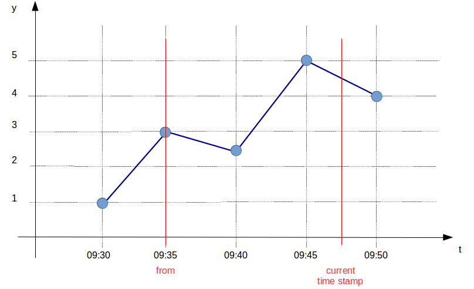

Запрос (``timeStep`` равен 5 минутам):

.. code-block:: json

  {
    "tagId": "1500c712-726a-103e-9264-a5021ec",
    "format": true,
    "start": "09:35:00",
    "timeStep": 300000000,
    "count": 4
  }

Ответ:

.. code-block:: json

  {
    "data": [
      {
        "tagId": "1500c712-726a-103e-9264-a5021ec2dae1",
        "data": [
          ["09:35:00", 3, null],
          ["09:40:00", 2.5, null],
          ["09:45:00", 4.5, null]
        ]
      }
    ]
  }

Несмотря на то, что ключ ``count`` равен 4, возвращено только 3 значения,
т.к. еще одно значение, имеющееся в базе, относится к будущему.

``timeStep``, ``start`` и ``finish``
....................................

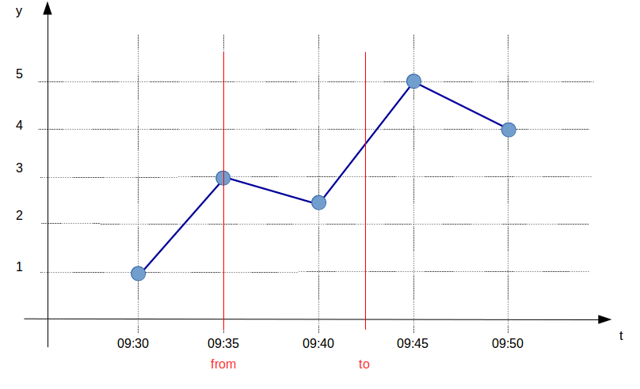

Запрос (``timeStep`` равен 5 минутам):

.. code-block:: json

  {
    "tagId": "1500c712-726a-103e-9264-a5021ec",
    "format": true,
    "start": "09:35:00",
    "finish": "09:42:30",
    "timeStep": 300000000
  }

Ответ:

.. code-block:: json

  {
    "data": [
      {
        "tagId": "1500c712-726a-103e-9264-a5021ec2dae1",
        "data": [
          ["09:35:00", 3, null],
          ["09:40:00", 2.5, null]
        ]
      }
    ]
  }

Запрос (``timeStep`` равен 10 минутам):

.. code-block:: json

  {
    "tagId": "1500c712-726a-103e-9264-a5021ec",
    "format": true,
    "start": "09:35:00",
    "finish": "09:42:30",
    "timeStep": 600000000
  }

Ответ:

.. code-block:: json

  {
    "data": [
      {
        "tagId": "1500c712-726a-103e-9264-a5021ec2dae1",
        "data": [
          ["09:35:00", 3, null]
        ]
      }
    ]
  }

.. _maxCount:

Ключ ``maxCount``
_________________
Этот ключ используется клиентами для того, чтобы информировать платформу,
какое максимальное количество значений тэга должно быть возвращено.

Представим тренд на экране. Его ширина - 800 пикселей. Это значит, что тренд
может отрисовать не более 800 значений по оси x.

Тренд устанавливает ключ ``maxCount`` в 800, при любом запросе на получение
данных. Если в хранилище больше, чем 800 значений за выбранный период,
платформа установит в ответе ключ ``excess`` в ``true`` и вернёт только
800 значений.

.. note::
   ``maxCount`` имеет приоритет над ``count``.

.. note::
   Использование ключа ``maxCount`` предотвращает крах платформы и повышает
   скорость работы. Установка этого ключа не обязательна, но рекомендуется.

Ключ ``actual``
_______________
Если ключ ``actual`` установлен в ``true``, выводятся только данные,
находящиеся в базе данных без интерполяции/присвоения на границах диапазона.
По умолчанию ключ ``actual`` установлен в ``false``.
Если ключ ``actual`` установлен в ``true``, ключ ``timeStep`` не учитывается.

Ниже представлены случаи использования ключа ``actual``
с различными комбинациями других ключей.

``start`` и ``actual``
......................
В этом случае возвращаются данные от метки времени,
заданной ``start``, до текущего момента времени.
Если на метку ``start`` и/или на текущий момент времени данных нет,
на эти метки времени ничего не возвращается.

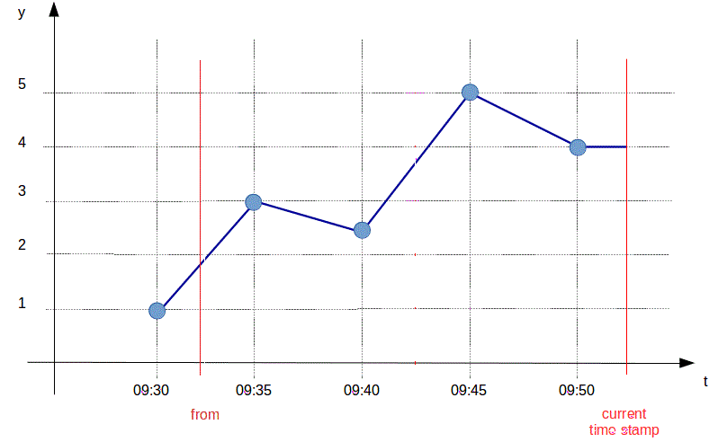

Запрос:

.. code-block:: json

  {
    "tagId": "1500c712-726a-103e-9264-a5021ec",
    "format": true,
    "start": "09:32:00",
    "actual": true
  }

Ответ:

.. code-block:: json

  {
    "data": [
      {
        "tagId": "1500c712-726a-103e-9264-a5021ec2dae1",
        "data": [
          ["09:35:00", 3, null],
          ["09:40:00", 2.5, null],
          ["09:45:00", 5, null],
          ["09:50:00", 4, null]
        ]
      }
    ]
  }

``start``, ``count``, ``actual``
................................
Возвращаются данные в количестве, заданном в ``count``.
Если данных в базе меньше, чем задано в ``count``,
возвращаются только имеющиеся данные.


Запрос:

.. code-block:: json

  {
    "tagId": "1500c712-726a-103e-9264-a5021ec",
    "format": true,
    "start": "09:32:00",
    "count": 3,
    "actual": true
  }

Ответ:

.. code-block:: json

  {
    "data": [
      {
        "tagId": "1500c712-726a-103e-9264-a5021ec2dae1",
        "data": [
          ["09:35:00", 3, null],
          ["09:40:00", 2.5, null],
          ["09:45:00", 5, null]
        ]
      }
    ]
  }


Запрос:

.. code-block:: json

  {
    "tagId": "1500c712-726a-103e-9264-a5021ec",
    "format": true,
    "start": "09:32:00",
    "count": 10,
    "actual": true
  }

Ответ:

.. code-block:: json

  {
    "data": [
      {
        "tagId": "1500c712-726a-103e-9264-a5021ec2dae1",
        "data": [
          ["09:35:00", 3, null],
          ["09:40:00", 2.5, null],
          ["09:45:00", 5, null],
          ["09:50:00", 4, null]
        ]
      }
    ]
  }

``actual`` и ``finish``
.......................
В этом случае возвращается значение на метку времени ``finish``
или последнее имеющееся значение перед меткой времени ``finish``
с соответствующей меткой
времени, если значения на метку времени ``finish`` нет.

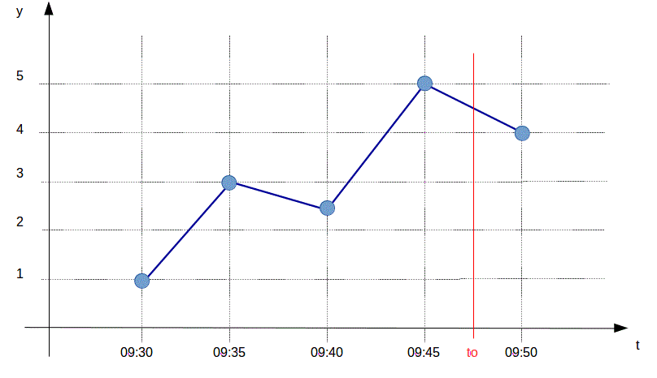

Запрос:

.. code-block:: json

  {
    "tagId": "1500c712-726a-103e-9264-a5021ec",
    "format": true,
    "finish": "09:47:30",
    "actual": true
  }

Ответ:

.. code-block:: json

  {
    "data": [
      {
        "tagId": "1500c712-726a-103e-9264-a5021ec2dae1",
        "data": [
          ["09:45:00", 5, null]
        ]
      }
    ]
  }

``finish``, ``count``, ``actual``
.................................
Возвращаются данные в количестве,
заданном в ``count``, от метки времени ``finish``.
Если данных в базе меньше, чем задано в ``count``,
возвращаются только имеющиеся данные.


Запрос:

.. code-block:: json

  {
    "tagId": "1500c712-726a-103e-9264-a5021ec",
    "format": true,
    "finish": "09:47:30",
    "count": 3,
    "actual": true
  }

Ответ:

.. code-block:: json

  {
    "data": [
      {
        "tagId": "1500c712-726a-103e-9264-a5021ec2dae1",
        "data": [
          ["09:35:00", 3, null],
          ["09:40:00", 2.5, null],
          ["09:45:00", 5, null]
        ]
      }
    ]
  }

``start``, ``finish``, ``actual``
.................................
В этом случае возвращаются имеющиеся в базе данные от метки
времени ``start`` до метки времени ``finish``.

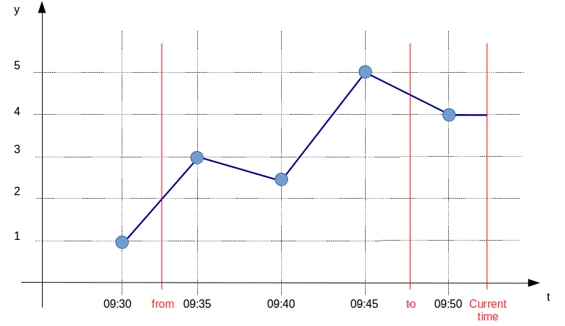

Запрос:

.. code-block:: json

  {
    "tagId": "1500c712-726a-103e-9264-a5021ec",
    "format": true,
    "start": "09:32:30",
    "finish": "09:47:30",
    "actual": true
  }

Ответ:

.. code-block:: json

  {
    "data": [
      {
        "tagId": "1500c712-726a-103e-9264-a5021ec2dae1",
        "data": [
          ["09:35:00", 3, null],
          ["09:40:00", 2.5, null],
          ["09:45:00", 5, null]
        ]
      }
    ]
  }

``start``, ``finish``, ``count``, ``actual``
............................................
Возвращаются данные в количестве, заданном в ``count``.
Если данных в базе меньше, чем задано в ``count``,
возвращаются только имеющиеся данные.


Запрос:

.. code-block:: json

  {
    "tagId": "1500c712-726a-103e-9264-a5021ec",
    "format": true,
    "start": "09:32:30",
    "finish": "09:47:30",
    "count":2,
    "actual": true
  }

Ответ:

.. code-block:: json

  {
    "data": [
      {
        "tagId": "1500c712-726a-103e-9264-a5021ec2dae1",
        "data": [
          ["09:35:00", 3, null],
          ["09:40:00", 2.5, null]
        ]
      }
    ]
  }


Запрос:

.. code-block:: json

  {
    "tagId": "1500c712-726a-103e-9264-a5021ec",
    "format": true,
    "start": "09:32:30",
    "finish": "09:47:30",
    "count":10,
    "actual": true
  }

Ответ:

.. code-block:: json

  {
    "data": [
      {
        "tagId": "1500c712-726a-103e-9264-a5021ec2dae1",
        "data": [
          ["09:35:00", 3, null],
          ["09:40:00", 2.5, null],
          ["09:45:00", 5, null]
        ]
      }
    ]
  }

``start``, ``finish``, ``maxCount``, ``actual``
...............................................
Возвращаются данные в количестве, заданном в ``maxCount``.
Если данных в базе меньше, чем задано в maxCount, возвращаются все данные
из базы и флаг ``excess`` устанавливается в false.
Если данных в базе больше, чем задано в ``maxCount``,
интервал времени разбивается на отрезки в соответствии с
``maxCount``. Данные интерполируются/заполняются. Если на метку ``start``
нет данных, возвращается ``null``. Если на метку ``finish`` нет данных,
возвращается последнее имеющееся значение перед меткой времени ``finish``.


Запрос:

.. code-block:: json

  {
    "tagId": "1500c712-726a-103e-9264-a5021ec",
    "format": true,
    "start": "09:32:30",
    "finish": "09:47:30",
    "maxCount": 10,
    "actual": true
  }

Ответ:

.. code-block:: json

  {
    "data": [
      {
        "tagId": "1500c712-726a-103e-9264-a5021ec2dae1",
        "data": [
          ["09:35:00", 3, null],
          ["09:40:00", 2.5, null],
          ["09:45:00", 5, null],
        ]
      }
    ]
  }


Запрос:

.. code-block:: json

  {
    "tagId": "1500c712-726a-103e-9264-a5021ec",
    "format": true,
    "start": "09:32:30",
    "finish": "09:47:30",
    "maxCount": 2,
    "actual": true
  }

Ответ:

.. code-block:: json

  {
    "data": [
      {
        "excess": true,
        "tagId": "1500c712-726a-103e-9264-a5021ec2dae1",
        "data": [
          ["09:32:30", null, null],
          ["09:47:30", 5, null]
        ]
      }
    ]
  }

Ключ ``value``
______________
Ключ ``value`` используется для фильтрации запрошенных данных.
Применяется в том случае,
когда необходимо получить конкретные значения тэга.
Перед сравнением фильтр приводится к типу тега:
число ``1`` у строкового тега ищется как строка ``"1"``.

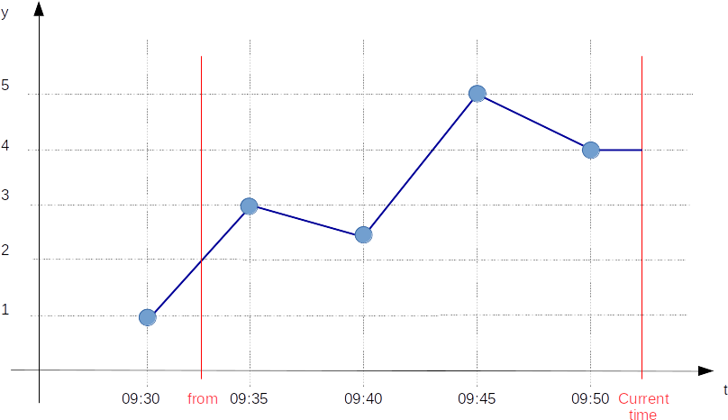

Запрос:

.. code-block:: json

  {
    "tagId": "1500c712-726a-103e-9264-a5021ec",
    "format": true,
    "start": "09:32:30",
    "value": [3]
  }

Ответ:

.. code-block:: json

  {
    "data": [
      {
        "tagId": "1500c712-726a-103e-9264-a5021ec2dae1",
        "data": [
          ["09:35:00", 3, null],
          ["09:42:00", 3, null]
        ]
      }
    ]
  }

Запрос:

.. code-block:: json

  {
    "tagId": "1500c712-726a-103e-9264-a5021ec",
    "format": true,
    "start": "09:32:30",
    "value": [3, 4]
  }

Ответ:

.. code-block:: json

  {
    "data": [
      {
        "tagId": "1500c712-726a-103e-9264-a5021ec2dae1",
        "data": [
          ["09:35:00", 3, null],
          ["09:41:00", 3, null],
          ["09:43:00", 4, null],
          ["09:50:00", 4, null],
          ["09:53:00", 4, null]
        ]
      }
    ]
  }

``value`` и ``actual``
......................
В этом случае запрос при фильтрации данных будет учитывать только
реальные данные, не интерполируя промежуточные значения.

Запрос:

.. code-block:: json

  {
    "tagId": "1500c712-726a-103e-9264-a5021ec",
    "format": true,
    "start": "09:32:30",
    "value": [3, 4],
    "actual": true
  }

Ответ:

.. code-block:: json

  {
    "data": [
      {
        "tagId": "1500c712-726a-103e-9264-a5021ec2dae1",
        "data": [
          ["09:35:00", 3, null],
          ["09:50:00", 4, null]
        ]
      }
    ]
  }

``null`` в истории данных
^^^^^^^^^^^^^^^^^^^^^^^^^
Важным моментом при работе с данными является случай, когда значением тэга
является ``null``.

Получение значения ``null`` в качестве данных тэга возможно, в первую очередь,
тогда, когда тэг создан и в его историю ещё ничего не записано (для этого
атрибут тэга ``smtTagDefaultValue`` должен быть пустым).

Кроме того, значение ``null`` записывается в тэг, когда:

#. Тэг привязан к источнику данных и с коннектором, записывающим данные в тэг,
   рвётся связь. В этом случае Платформа запишет в тэг значение ``null``, код
   качества значения ``q`` = 100.
#. Связь с коннектором восстановлена после кода 100. Платформа записывает в
   привязанные теги значение ``null``, код качества ``q`` = 101 (до ответа
   коннектору полной конфигурацией; см. ``connectors.rst``).
#. Тэг привязан к источнику данных и у коннектора рвётся связь с поставщиком
   данных. В этом случае коннектор запишет в тэг значение ``null`` с кодом
   качества значения ``q`` = 102.
#. Тэг привязан к источнику данных и коннектор получает от поставщика данных
   значение ``null``.
#. В тэг было записано значение ``null`` командой ``data/set``.

Считается, что с момента записи в тэг значения ``null`` до записи следующего
значения мы ничего не знаем о данных тэга, в них как бы образовывается дыра.
Поэтому значения тэга не интерполируются на этом промежутке.

При запросе данных за период ``null`` возвращается клиенту, если попадает в
этот промежуток.

На картинке ниже показывается, как интерпретируются данные в случае, если
в истории есть ``null``.

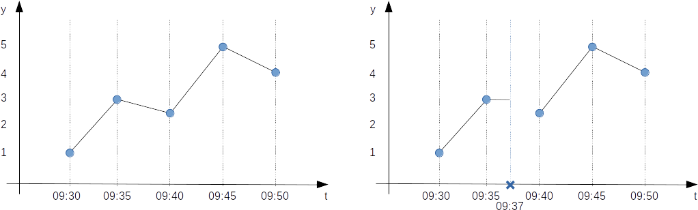

Далее - несколько примеров запросов к данным, показанным на картинке выше
с ответами.

.. rubric:: Запрос 1

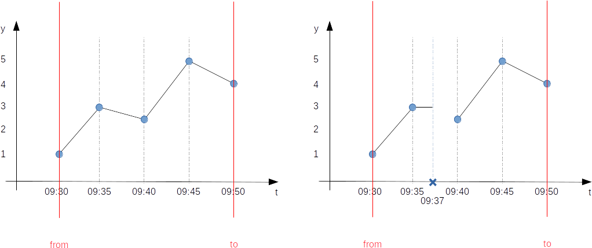

.. code-block:: json

  {
    "tagId": "1500c712-726a-103e-9264-a5021ec",
    "format": true,
    "start": "09:30:00",
    "finish": "09:50:00"
  }

**Ответ без ``null``:**

.. code-block:: json

  {
    "data": [
      {
        "tagId": "1500c712-726a-103e-9264-a5021ec2dae1",
        "data": [
          ["09:30:00", 1, null],
          ["09:35:00", 3, null],
          ["09:40:00", 2.5, null],
          ["09:45:00", 5, null],
          ["09:50:00", 4, null]
        ]
      }
    ]
  }

**Ответ с ``null``:**

.. code-block:: json

  {
    "data": [
      {
        "tagId": "1500c712-726a-103e-9264-a5021ec2dae1",
        "data": [
          ["09:30:00", 1, null],
          ["09:35:00", 3, null],
          ["09:37:00", null, null],
          ["09:40:00", 2.5, null],
          ["09:45:00", 5, null],
          ["09:50:00", 4, null]
        ]
      }
    ]
  }

.. rubric:: Запрос 2

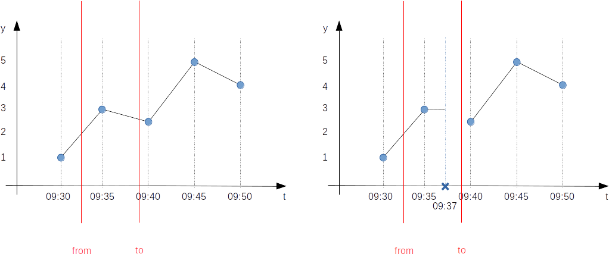

.. code-block:: json

  {
    "tagId": "1500c712-726a-103e-9264-a5021ec",
    "format": true,
    "start": "09:32:30",
    "finish": "09:39:00"
  }

**Ответ без ``null``:**

.. code-block:: json

  {
    "data": [
      {
        "tagId": "1500c712-726a-103e-9264-a5021ec2dae1",
        "data": [
          ["09:32:30", 2, null],
          ["09:35:00", 3, null],
          ["09:39:00", 2.6, null]
        ]
      }
    ]
  }

**Ответ с ``null``:**

.. code-block:: json

  {
    "data": [
      {
        "tagId": "1500c712-726a-103e-9264-a5021ec2dae1",
        "data": [
          ["09:32:30", 2, null],
          ["09:35:00", 3, null],
          ["09:37:00", null, null],
          ["09:39:00", null, null]
        ]
      }
    ]
  }

.. rubric:: Запрос 3

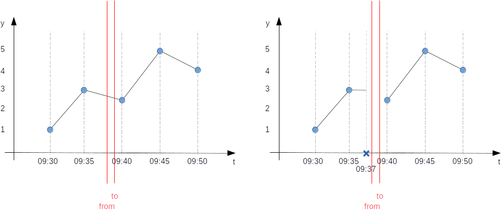

.. code-block:: json

  {
    "tagId": "1500c712-726a-103e-9264-a5021ec",
    "format": true,
    "start": "09:38:00",
    "finish": "09:39:00"
  }

**Ответ без ``null``:**

.. code-block:: json

  {
    "data": [
      {
        "tagId": "1500c712-726a-103e-9264-a5021ec2dae1",
        "data": [
          ["09:38:00", 2.7, null],
          ["09:39:00", 2.6, null]
        ]
      }
    ]
  }

**Ответ с ``null``:**

.. code-block:: json

  {
    "data": [
      {
        "tagId": "1500c712-726a-103e-9264-a5021ec2dae1",
        "data": [
          ["09:38:00", null, null],
          ["09:39:00", null, null]
        ]
      }
    ]
  }

.. rubric:: Запрос 4. ``timeStep``

Сделаем запрос с флагом ``timeStep`` в 4 минуты:

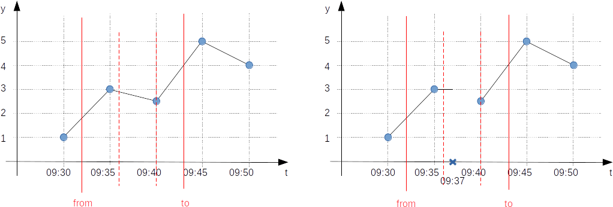

.. code-block:: json

  {
    "tagId": "1500c712-726a-103e-9264-a5021ec",
    "format": true,
    "start": "09:32:00",
    "finish": "09:43:00",
    "timeStep": 240000000
  }

**Ответ без ``null``:**

.. code-block:: json

  {
    "data": [
      {
        "tagId": "1500c712-726a-103e-9264-a5021ec2dae1",
        "data": [
          ["09:32:00", 1.8, null],
          ["09:36:00", 2.9, null],
          ["09:40:00", 2.5, null]
        ]
      }
    ]
  }

**Ответ с ``null``:**

.. code-block:: json

  {
    "data": [
      {
        "tagId": "1500c712-726a-103e-9264-a5021ec2dae1",
        "data": [
          ["09:32:00", 1.8, null],
          ["09:36:00", 3, null],
          ["09:40:00", 2.5, null]
        ]
      }
    ]
  }

.. rubric:: Запрос 5. ``timeStep``

Теперь сделаем запрос с флагом ``timeStep`` в 2 минуты:

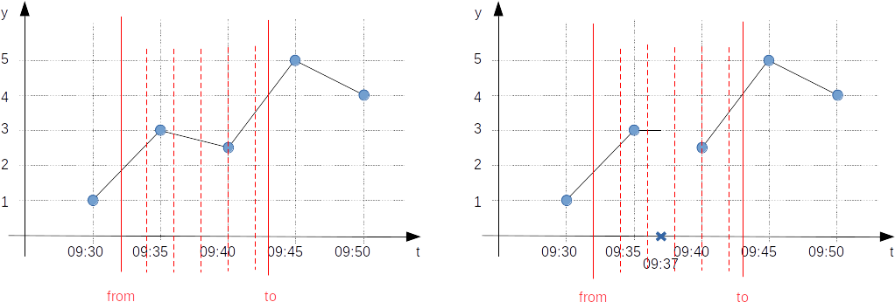

.. code-block:: json

  {
    "tagId": "1500c712-726a-103e-9264-a5021ec",
    "format": true,
    "start": "09:32:00",
    "finish": "09:43:00",
    "timeStep": 120000000
  }

**Ответ без ``null``:**

.. code-block:: json

  {
    "data": [
      {
        "tagId": "1500c712-726a-103e-9264-a5021ec2dae1",
        "data": [
          ["09:32:00", 1.8, null],
          ["09:34:00", 2.6, null],
          ["09:36:00", 2.9, null],
          ["09:38:00", 2.7, null],
          ["09:40:00", 2.5, null],
          ["09:42:00", 3.5, null]
        ]
      }
    ]
  }

**Ответ с ``null``:**

.. code-block:: json

  {
    "data": [
      {
        "tagId": "1500c712-726a-103e-9264-a5021ec2dae1",
        "data": [
          ["09:32:00", 1.8, null],
          ["09:34:00", 2.6, null],
          ["09:36:00", 3, null],
          ["09:38:00", null, null],
          ["09:40:00", 2.5, null],
          ["09:42:00", 3.5, null]
        ]
      }
    ]
  }
